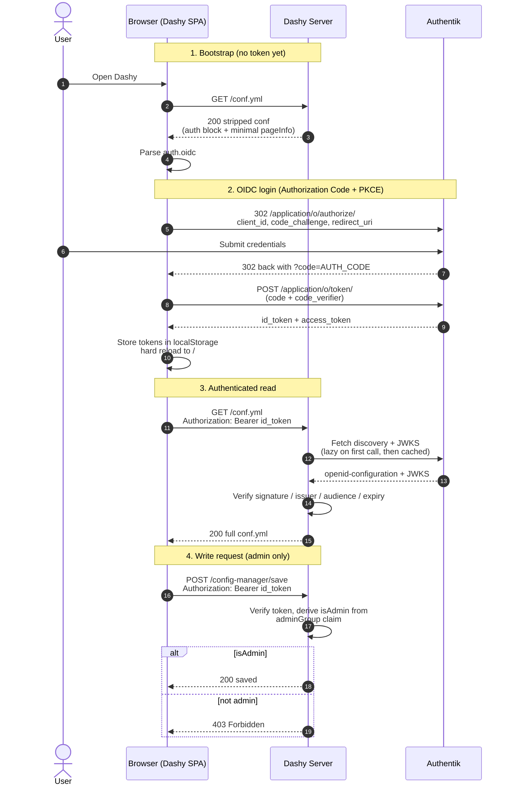
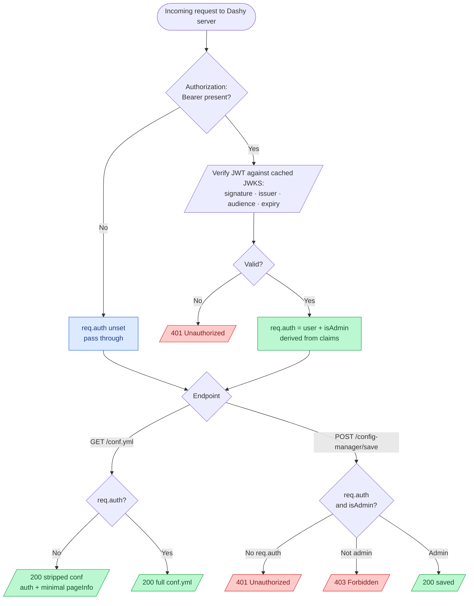

# Authentik OIDC

Dashy supports using [Authentik](https://goauthentik.io/) as its OIDC provider.

[Authentik](https://goauthentik.io/) is an [open source](https://github.com/goauthentik/authentik) identity provider that speaks OIDC, OAuth 2.0, SAML 2.0 and LDAP. It runs in Docker, has a polished admin UI, and supports MFA, social login, and per-application group policies, which makes it a good fit for self-hosted setups where you want a single login across many services.

### Contents

- [1. Deploy Authentik](#1-deploy-authentik)
- [2. Configure Authentik](#2-configure-authentik)
  - [Create the groups scope](#create-the-groups-scope)
  - [Create the OIDC provider](#create-the-oidc-provider)
  - [Create the application](#create-the-application)
  - [Create the admin group](#create-the-admin-group)
  - [Create test users](#create-test-users)
  - [Restrict who can access Dashy (optional)](#restrict-who-can-access-dashy-optional)
- [3. Enabling Authentik in Dashy](#3-enabling-authentik-in-dashy)
- [4. Groups and Visibility](#4-groups-and-visibility)
- [5. Silent token renewal (optional)](#5-silent-token-renewal-optional)
- [Troubleshooting](#troubleshooting-common-authentik-issues)
- [How it Works](#how-it-works)
  - [Client side](#client-side)
  - [Server side](#server-side)
  - [Visual Overview](#visual-overview)

## 1. Deploy Authentik

If you've not already done so, spin up an Authentik instance, following the [official docs](https://docs.goauthentik.io/docs/install-config/install/docker-compose). The compose file below is a minimal local setup.

A `.env` file alongside the compose file (generate fresh secrets with `openssl rand -hex 32`):

```env
AUTHENTIK_TAG=2024.12
PG_PASS=replace-me-with-random-hex
AUTHENTIK_SECRET_KEY=replace-me-with-random-hex
AUTHENTIK_BOOTSTRAP_PASSWORD=change-me-now
AUTHENTIK_BOOTSTRAP_EMAIL=you@example.com
AUTHENTIK_BOOTSTRAP_TOKEN=replace-me-with-random-hex
```

<details>
    <summary>Example <code>docker-compose.yml</code></summary>

```yaml
name: authentik

services:
  postgresql:
    image: docker.io/library/postgres:16-alpine
    restart: unless-stopped
    healthcheck:
      test: ["CMD-SHELL", "pg_isready -d $${POSTGRES_DB} -U $${POSTGRES_USER}"]
      start_period: 20s
      interval: 10s
      retries: 5
      timeout: 5s
    volumes:
      - ./data/postgres:/var/lib/postgresql/data
    environment:
      POSTGRES_PASSWORD: ${PG_PASS}
      POSTGRES_USER: authentik
      POSTGRES_DB: authentik

  redis:
    image: docker.io/library/redis:7-alpine
    command: --save 60 1 --loglevel warning
    restart: unless-stopped
    healthcheck:
      test: ["CMD-SHELL", "redis-cli ping | grep PONG"]
      start_period: 20s
      interval: 10s
      retries: 5
      timeout: 3s
    volumes:
      - ./data/redis:/data

  server:
    image: ghcr.io/goauthentik/server:${AUTHENTIK_TAG}
    restart: unless-stopped
    command: server
    environment: &authentik-env
      AUTHENTIK_REDIS__HOST: redis
      AUTHENTIK_POSTGRESQL__HOST: postgresql
      AUTHENTIK_POSTGRESQL__USER: authentik
      AUTHENTIK_POSTGRESQL__NAME: authentik
      AUTHENTIK_POSTGRESQL__PASSWORD: ${PG_PASS}
      AUTHENTIK_SECRET_KEY: ${AUTHENTIK_SECRET_KEY}
      AUTHENTIK_BOOTSTRAP_PASSWORD: ${AUTHENTIK_BOOTSTRAP_PASSWORD}
      AUTHENTIK_BOOTSTRAP_TOKEN: ${AUTHENTIK_BOOTSTRAP_TOKEN}
      AUTHENTIK_BOOTSTRAP_EMAIL: ${AUTHENTIK_BOOTSTRAP_EMAIL}
      AUTHENTIK_ERROR_REPORTING__ENABLED: "false"
    ports:
      - "9000:9000"
      - "9443:9443"
    depends_on:
      postgresql: {condition: service_healthy}
      redis: {condition: service_healthy}

  worker:
    image: ghcr.io/goauthentik/server:${AUTHENTIK_TAG}
    restart: unless-stopped
    command: worker
    environment: *authentik-env
    depends_on:
      postgresql: {condition: service_healthy}
      redis: {condition: service_healthy}
```

</details>

Bring it up:

```bash
docker compose up -d
```

First boot runs database migrations and takes a minute or two. Once the `server` container is healthy, open `http://localhost:9000` and sign in as `akadmin` with the bootstrap password.

---

## 2. Configure Authentik

### Create the groups scope

Authentik doesn't expose group membership in the id_token by default. Dashy needs it for the `adminGroup` check and for the `showForKeycloakUsers` / `hideForKeycloakUsers` visibility rules.

1. Go to **Customisation > Property Mappings**
2. Click **Create > Scope Mapping**
3. Set **Name** to `groups`
4. Set **Scope name** to `groups`
5. Set **Expression** to:

```python
return {"groups": [g.name for g in request.user.ak_groups.all()]}
```

6. Click **Finish**

### Create the OIDC provider

1. Go to **Applications > Providers**
2. Click **Create**, pick **OAuth2/OpenID Provider**, click **Next**
3. Set **Name** to `Dashy`
4. Set **Authorization flow** to `default-provider-authorization-implicit-consent` (use `default-provider-authorization-explicit-consent` if you want users to confirm sign-in each time)
5. Set **Invalidation flow** to `default-provider-invalidation-flow` (required on Authentik 2023.10 and newer)
6. Under **Protocol settings**:
   - **Client type**: `Public`
   - **Client ID**: `dashy`, or leave the auto-generated value and copy it for later
   - **Redirect URIs** with matching mode `Strict`, one URL per line. Register both the bare URL and the trailing-slash version:
     - `https://dashy.example.com`
     - `https://dashy.example.com/`
   - **Signing Key**: the built-in `authentik Self-signed Certificate` is fine
7. Expand **Advanced protocol settings**:
   - Add `openid`, `profile`, `email`, and the `groups` scope you just created to **Scopes**
   - Turn **Include claims in id_token** on
8. Click **Finish**

### Create the application

1. Go to **Applications > Applications**
2. Click **Create**
3. Set **Name** to `Dashy`
4. Set **Slug** to `dashy` (this becomes part of the issuer URL: `<host>/application/o/<slug>/`)
5. Set **Provider** to the `Dashy` provider you just made
6. Click **Create**

Now open the `Dashy` provider again (**Applications > Providers > Dashy**) and copy the **OpenID Configuration Issuer URL** shown on the page (e.g. `https://auth.example.com/application/o/dashy/`). The provider only displays a valid URL once it's bound to an application. You'll need this for Dashy's `endpoint` setting later.

### Create the admin group

1. Go to **Directory > Groups**
2. Click **Create**
3. Set **Name** to `dashy-admins`
4. Click **Create**
5. Open the new group, click **Users**, and add any users who should have admin rights in Dashy

### Create test users

If you want separate accounts beyond `akadmin`:

1. Go to **Directory > Users**
2. Click **Create**, fill in **Username**, **Name** and **Email**, click **Create**
3. On the new user's page, click **Set password**, set a password, click **Update**
4. Add the user to `dashy-admins` for admin access, or leave them out for a non-admin

### Restrict who can access Dashy (optional)

By default any Authentik user can sign in to Dashy. To limit access to one or more groups, bind a group policy to the `Dashy` application; Authentik then denies sign-in to anyone outside those groups. This is separate from `adminGroup`, which only controls who gets admin rights inside Dashy, not who can access it at all.

1. Go to **Applications > Applications** and open the `Dashy` application


2. Open the **Policy / Group / User Bindings** tab and click **Bind existing policy**


3. Switch to the **Group** tab, choose the group that should have access, make sure **Enabled** is on, and click **Create**


Access is now limited to members of the bound group. Add another binding for each additional group that should be allowed in.

### Summary

Authentik should now be configured, and ready to go!

---

## 3. Enabling Authentik in Dashy

Finally, you need to tell Dashy to use Authentik. This goes in the `appConfig.auth` section of your main `/user-data/conf.yml`.

```yaml
appConfig:
  ...
  disableConfigurationForNonAdmin: true
  auth:
    enableOidc: true
    oidc:
      clientId: dashy
      endpoint: https://auth.example.com/application/o/dashy/
      adminGroup: dashy-admins
      scope: openid profile email groups
```

Where:
- `disableConfigurationForNonAdmin` - Prevent read/write config access to non-admin users
- `auth.enableOidc` - Set the auth mode to OIDC
- `clientId` - The Client ID from the Authentik provider (exact, case-sensitive)
- `endpoint` - The OpenID Configuration Issuer URL from the provider page. Use the bare issuer, not the discovery URL; Dashy appends `/.well-known/openid-configuration` itself
- `adminGroup` - Name of the Authentik group that grants admin in Dashy (matches the `dashy-admins` group above)
- `scope` - Space-separated list of scopes to request. Must include `groups` when `adminGroup` is set, otherwise the id_token won't carry the claim

Restart Dashy for these changes to take effect.

If Authentik runs on a different host or behind a reverse proxy, make sure `endpoint` is reachable from inside the Dashy container, and that the issuer URL the provider advertises matches `endpoint` exactly.

Everything should now be fully configured and working 🎉
When you load Dashy, you'll be redirected to Authentik's login page. After signing in you will land back on Dashy's homepage with full access, and all of Dashy's client, server and asset endpoints will be locked behind authentication.

---

## 4. Groups and Visibility

Once group membership is in the id_token, you can use it to hide or show pages, sections and items in Dashy. The property name is `hideForKeycloakUsers` / `showForKeycloakUsers` (the name is historical; it works for any OIDC provider, including Authentik).

To make an Admin section visible only to members of `dashy-admins`:

```yaml
displayData:
  showForKeycloakUsers:
    groups:
      - dashy-admins
```

Both `showForKeycloakUsers` and `hideForKeycloakUsers` accept lists of `groups` and `roles`. If a user matches an entry they're allowed or excluded as defined.

```yaml
sections:
  - name: Internal Tools
    displayData:
      showForKeycloakUsers:
        groups: ['dashy-admins']
      hideForKeycloakUsers:
        groups: ['guests']
    items:
      - title: Hidden from interns
        displayData:
          hideForKeycloakUsers:
            groups: ['interns']
```


## 5. Silent token renewal (optional)

By default, when your token expires Dashy sends you back through Authentik's login to get a new one. Set `enableSilentRenew: true` to have Dashy refresh the session quietly in the background instead, using a refresh token:

```yaml
    oidc:
      clientId: dashy
      endpoint: https://auth.example.com/application/o/dashy/
      adminGroup: dashy-admins
      scope: openid profile email groups
      enableSilentRenew: true
```

Dashy adds the `offline_access` scope to its request automatically. Authentik ships an `offline_access` scope mapping by default, so just make sure it's listed under the provider's **Advanced protocol settings > Selected Scopes**. It's off by default, and if a refresh ever fails Dashy falls back to the normal sign-in. See [silent token renewal](./oidc.md#silent-token-renewal) for the full notes and caveats.

---

## Troubleshooting common Authentik Issues

#### Migrations still running on first boot
Problem: Authentik returns 502 or never reaches the login page right after `docker compose up`.<br>
Solution: First boot runs database migrations and can take a minute or two. Tail the logs with `docker compose logs -f server` and wait for the `uvicorn` startup line before opening the UI.

#### Redirect loop after login
Problem: Browser bounces between Dashy and Authentik repeatedly.<br>
Solution: `endpoint` in `conf.yml` probably includes `.well-known/openid-configuration`. Drop everything from `.well-known` onwards; Dashy appends it itself.

#### invalid_redirect_uri
Problem: Authentik shows "invalid redirect URI" after submitting credentials.<br>
Solution: The URL Dashy is being served from doesn't exactly match what's registered on the provider. Register both the bare URL and the trailing-slash variant (e.g. `https://dashy.example.com` and `https://dashy.example.com/`), keep matching mode on `Strict`, and make sure the scheme matches (`http` vs `https`).

#### Logged in but config saves return 403
Problem: User authenticates fine, but saving the dashboard returns 403.<br>
Solution: The id_token isn't carrying the group claim. Paste the token (from localStorage, key `ID_TOKEN`) into [jwt.io](https://jwt.io) and look for `groups`. If it's missing, the `groups` scope mapping isn't attached to the provider's **Scopes** or **Include claims in id_token** is off. If the claim is there but the user isn't in it, add them to the `dashy-admins` group.

#### Issuer mismatch behind a reverse proxy
Problem: Server logs show `unexpected "iss" claim value`. The browser reaches Authentik over HTTPS, but Authentik advertises an HTTP issuer in its discovery document.<br>
Solution: Set `AUTHENTIK_LISTEN__TRUSTED_PROXY_CIDRS` on the Authentik server and worker containers to include your proxy's IP range (e.g. `172.16.0.0/12` for default Docker bridges), and make sure the proxy forwards `X-Forwarded-Proto: https`. Once Authentik trusts the proxy, its discovery document will advertise the public HTTPS URL.

#### Audience mismatch on token verification
Problem: Server logs show `unexpected "aud" claim value`. Every auth'd API call returns 401.<br>
Solution: `clientId` in `conf.yml` must exactly match the provider's **Client ID** field. If you let Authentik auto-generate one, copy the exact value (including case) from the provider page.

#### Self-signed Authentik certificate rejected
Problem: Dashy server logs show TLS errors (`self-signed certificate`, `UNABLE_TO_VERIFY_LEAF_SIGNATURE`) when fetching the discovery doc or JWKS.<br>
Solution: Use a real certificate on the Authentik HTTPS endpoint (Let's Encrypt or your homelab CA), or mount your CA bundle into the Dashy container and set `NODE_EXTRA_CA_CERTS=/path/to/ca.pem`. Authentik's built-in `authentik Self-signed Certificate` is only used to sign tokens; the TLS cert is whatever's terminating HTTPS in front of Authentik.

#### "OIDC signinCallback returned no user"
Problem: Login submits, Authentik redirects back, then Dashy shows the error toast `OIDC signinCallback returned no user`.<br>
Solution: The id_token came back without a usable username claim. Confirm `profile` and `email` are in the provider's **Scopes**, that **Include claims in id_token** is on, and that the user has an email or username set in Authentik.

#### Logout stuck on a consent screen
Problem: Clicking Logout sends the user to Authentik's end-session endpoint, which prompts for confirmation and never returns.<br>
Solution: This is the default behaviour of `default-provider-invalidation-flow`. To skip the prompt, change the provider's **Invalidation flow** to one without a consent stage, or accept the extra click.

#### Token expired / clock skew
Problem: 401s with `"exp" claim timestamp check failed` or `"iat" claim timestamp check failed`, even just after login.<br>
Solution: Dashy allows 30 seconds of drift. Sync clocks on both hosts with NTP. Container clocks follow their host, so it's almost always the host that's drifted.

#### Numeric Client ID truncated
Problem: Audience mismatch when `clientId` in `conf.yml` is a long numeric string.<br>
Solution: Wrap numeric Client IDs in quotes (e.g. `clientId: "12345678901234567"`). Without quotes YAML parses the value as a JS number and loses precision past around 15 digits.

#### Dashy server can't reach Authentik
Problem: Auth'd API calls return 401 and Dashy logs show fetch errors for `.well-known/openid-configuration`.<br>
Solution: `endpoint` must be reachable from inside the Dashy container, not just from the browser. If both run in Docker, put them on the same network. Test with `docker exec <dashy-container> wget -qO- "$ENDPOINT/.well-known/openid-configuration"`.

#### Config change to auth.oidc not picked up
Problem: Updated `clientId`, `endpoint`, `adminGroup` or `scope` in `conf.yml`, but Dashy still uses the old values.<br>
Solution: The server reads the auth config only at boot. Restart the Dashy container after any change to fields under `auth.oidc`.

---

## How it Works

If you're a developer or contributor looking to understand or make changes to Dashy's OIDC implementation, the following outlines how it's wired together.

The same OIDC pipeline backs Authentik, Keycloak, and any other generic OIDC provider. The only Authentik-specific code is your configuration; everything else is shared.

### Client side

Boot starts in [`src/main.js`](https://github.com/lissy93/dashy/blob/4.1.5/src/main.js). After the initial `/conf.yml` fetch parses the auth block, `isOidcEnabled()` decides whether to lazily import [`oidc-client-ts`](https://github.com/authts/oidc-client-ts) and call `initOidcAuth()`.

[`src/utils/auth/OidcAuth.js`](https://github.com/lissy93/dashy/blob/4.1.5/src/utils/auth/OidcAuth.js) wraps `oidc-client-ts`. On load it inspects the URL: if it sees a `?code=` callback it runs `userManager.signinCallback()` to exchange the code (and PKCE verifier) for tokens, persists the user info, and hard-redirects to `/`. Otherwise it calls `userManager.getUser()`; if there's no usable session it falls through to `userManager.signinRedirect()` to send the browser to Authentik. A short-lived `sessionStorage` guard prevents the redirect loop that would otherwise occur if the IdP returns without a usable user.

`persistUserInfo()` writes the raw `id_token`, the user's `groups` and `roles`, a derived `isAdmin` flag, and a username (falling back through `preferred_username`, `email`, and `sub`) to localStorage. The keys (`ID_TOKEN`, `KEYCLOAK_INFO`, `USERNAME`, `ISADMIN`) live in [`src/utils/config/defaults.js`](https://github.com/lissy93/dashy/blob/4.1.5/src/utils/config/defaults.js); the `KEYCLOAK_INFO` name is historical and reused for all OIDC providers, including Authentik.

[`src/utils/auth/getApiAuthHeader.js`](https://github.com/lissy93/dashy/blob/4.1.5/src/utils/auth/getApiAuthHeader.js) builds the Authorization header for every internal API call. It does a client-side `exp` check and returns `null` for missing or expired tokens, so the next request triggers a fresh login rather than a 401.

[`src/utils/IsVisibleToUser.js`](https://github.com/lissy93/dashy/blob/4.1.5/src/utils/IsVisibleToUser.js) reads `KEYCLOAK_INFO` when evaluating `showForKeycloakUsers` and `hideForKeycloakUsers` rules.

### Server side

[`services/auth-oidc.js`](https://github.com/lissy93/dashy/blob/4.1.5/services/auth-oidc.js) contains the entire server-side auth surface, in five small pieces:

- `loadOidcSettings()` reads `auth.oidc` (or `auth.keycloak`) at boot and returns a normalised `{ issuer, clientId, adminGroup, adminRole }`. For generic OIDC providers the `issuer` is whatever you set as `endpoint` in `conf.yml`, verbatim
- `createOidcMiddleware()` returns a Connect middleware. Permissive on no-token requests so the SPA can bootstrap; otherwise it verifies the Bearer token against the issuer's JWKS using [`jose`](https://github.com/panva/jose). Checks cover signature, issuer (against the canonical value from the discovery doc), audience (must equal `clientId`), and expiry, with a 30-second clock-skew tolerance. Sets `req.auth = { user, isAdmin, claims }` on success, `401` on failure
- `getIssuerContext()` lazily fetches `.well-known/openid-configuration` on first use and wraps `jwks_uri` in `createRemoteJWKSet`, which handles JWKS caching and on-demand key rotation. The result is memoised per-issuer for the life of the process
- `deriveIsAdmin()` checks the token's `groups` claim against `adminGroup`, and the top-level `roles` claim against `adminRole` (for Keycloak it also folds in the nested `realm_access.roles` / `resource_access.<clientId>.roles` arrays). Authentik only emits `groups`, so the group path is what's used in practice
- `maybeBootstrapConfig()` is the stripped-response helper. When auth is configured, guest access is off, and an unauthenticated request hits the root `/conf.yml`, it returns a minimal copy with only `appConfig.auth`, `appConfig.enableServiceWorker`, and a `pageInfo.title` of `Login | <your title>`. Sections, items, hostnames and any other secrets never leave the server

[`services/app.js`](https://github.com/lissy93/dashy/blob/4.1.5/services/app.js) wires it all together. The middleware mounts as `protectConfig` in front of every YAML route and config-mutating route. The `/*.yml` handler sets `Cache-Control: private, no-store` and `Vary: Authorization` whenever auth is configured (so intermediate caches can never mix auth states), then calls `maybeBootstrapConfig`; a stripped result is sent as-is, otherwise `res.sendFile` serves the full file. `POST /config-manager/save` is additionally guarded by `requireAdmin`, which returns `401` if `req.auth` is unset and `403` if `req.auth.isAdmin` is false.

### Visual Overview

<details>

<summary>End-to-end authentication flow</summary>



</details>


<details>

<summary>Server-side request handling</summary>



</details>
