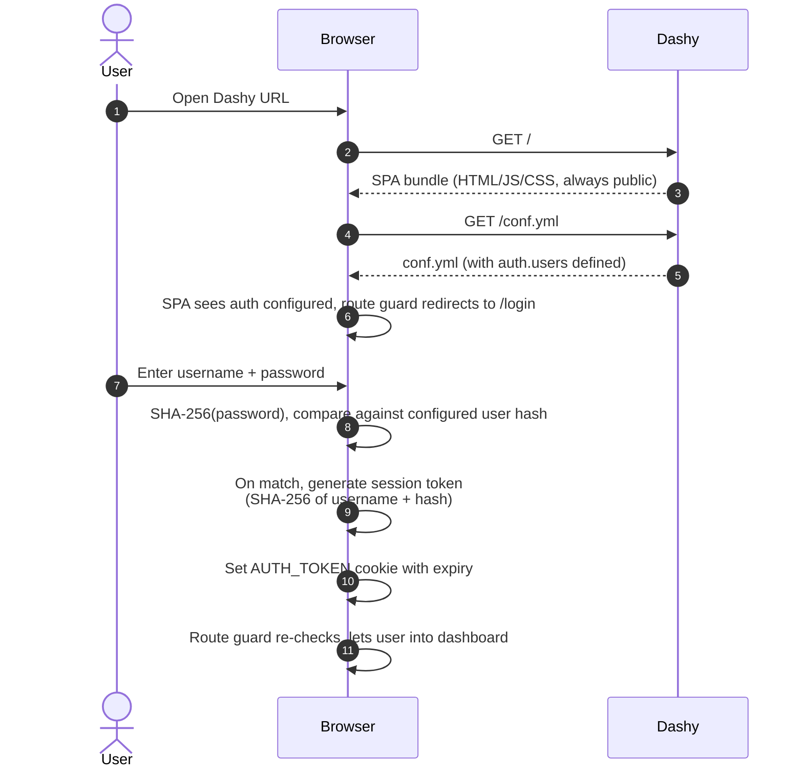
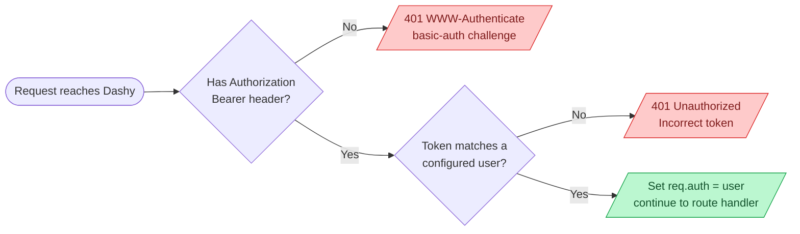
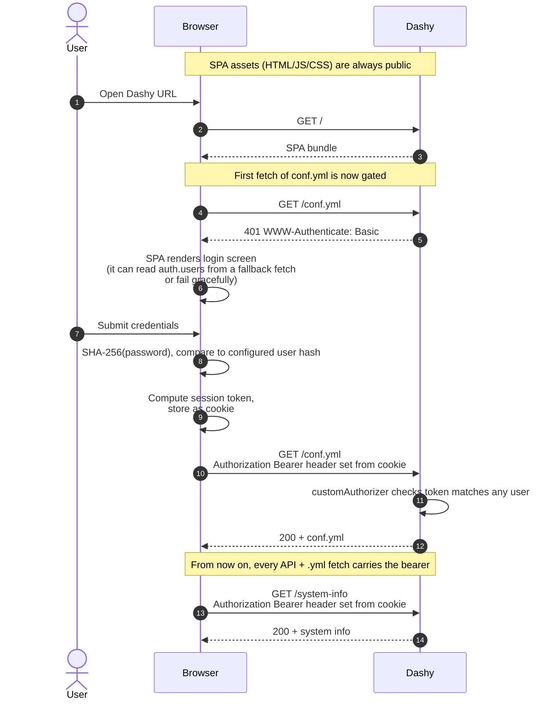

# Built-In Auth

Dashy ships with a simple username + password auth system baked in, as well as the option to enforce this server-side with standard HTTP auth.

This is the quickest way to setup a login screen, without the need to run any other auth services. No identity provider to run, no external dependencies, just a list of users in `conf.yml`. Useful for keeping casual eyes of your dashboard within a LAN, but is probably not recommended if your instance is exposed to the public internet.

This guide covers everything the built-in auth can do, from the lightest "show a login screen" mode to a server-enforced setup that 401s every unauthenticated request. If you need OIDC, SSO, or anything internet-facing, see the other guides in this folder. **Built-in auth is convenient, not hardened**.

### Contents

- [Quick Start](#quick-start)
- [Defining Users](#defining-users)
- [Choosing a Protection Mode](#choosing-a-protection-mode)
- [Sessions, Guest Access & Logout](#sessions-guest-access--logout)
- [User Roles & Visibility](#user-roles--visibility)
- [Auto-Authenticating the Frontend](#auto-authenticating-the-frontend)
- [Troubleshooting](#troubleshooting-common-built-in-auth-issues)
- [Security Considerations](#security-considerations)
- [How it Works](#how-it-works)

## Quick Start

Add a single user to `appConfig.auth.users` in `conf.yml`, with a SHA-256 hash of your password:

```yaml
appConfig:
  disableConfigurationForNonAdmin: true
  auth:
    users:
      - user: alicia
        hash: 5994471ABB01112AFCC18159F6CC74B4F511B99806DA59B3CAF5A9C173CACFC5
        type: admin
```

```env
ENABLE_HTTP_AUTH=true
```

Restart Dashy for changes to take effect. You'll be bounced to a login screen. Enter your username and the plaintext password that hashes to the value above (`12345` if you copy-pasted the example. Please change it).

## Defining Users

`appConfig.auth.users` is a list of user records. Each entry has a username, a password (as a hash or via an env var), and an optional admin flag.

```yaml
appConfig:
  auth:
    users:
      - user: alicia
        hash: 5994471ABB01112AFCC18159F6CC74B4F511B99806DA59B3CAF5A9C173CACFC5
        type: admin
      - user: guest
        hash: EF797C8118F02DFB649607DD5D3F8C7623048C9C063D532CC95C5ED7A898A64F
        type: normal
```

Field reference:
- `user` - Username. Lowercased on lookup, so casing doesn't matter at login
- `hash` - SHA-256 hash of the password, hex, 64 chars. Either upper or lower case works
- `type` - `admin` or `normal`. Defaults to `normal`. Admins can save config changes; normal users cannot. See [User Roles & Visibility](#user-roles--visibility) for what else this gates
- `password` - Alternative to `hash`. The name of a `VITE_APP_*` environment variable holding the plaintext password. Dashy hashes the env var's value at runtime. This requires building the app from source (don't work with pre-built Docker image)

Each user needs `user` plus exactly one of `hash` or `password` (not both!)

### Generating a password hash

If you're using `hash`, you need to create a SHA-256 hash [↗](https://en.wikipedia.org/wiki/Sha-256) of your password. Either run `echo -n "my-super-secure-password" | sha256sum`, or use an online tool, such as [this one](https://emn178.github.io/online-tools/sha256.html) or [CyberChef](https://gchq.github.io/CyberChef/) (which can be self-hosted and run locally).

### Using an env var instead of an inline hash

If you'd rather not put hashed passwords to `conf.yml`, point at an env var:

```yaml
- user: alicia
  password: VITE_APP_ALICIA_PASSWORD
```

Then run Dashy with `VITE_APP_ALICIA_PASSWORD=supersecret`. Dashy hashes the value at login time and compares it to what the user types. The env var name must start with `VITE_APP_`; anything else is rejected.

> [!WARNING]
> Caveat: env-var passwords only resolve in the browser if the variable was set when the Dashy bundle was *built*. The official Docker image is pre-built, so it can't pick up env-var users you set at runtime for the frontend. For env-var users to work, either build Dashy yourself or use `hash` inline instead. The server-side enforcement does read env vars at runtime regardless.

## Choosing a Protection Mode

Defining users is one decision. Deciding *what those users protect* is another. There are three modes, depending on your use case:

| Mode | What you set | Login page? | Server enforces? |
|---|---|---|---|
| Client-side only | `auth.users` in conf.yml | ✅ yes | ❌ no |
| Server-enforced via conf.yml users | `auth.users` + `ENABLE_HTTP_AUTH=true` | ✅ yes | ✅ yes |
| Static credentials | `BASIC_AUTH_USERNAME` + `BASIC_AUTH_PASSWORD` env vars | ❌ no (browser prompt) | ✅ yes |


### Client-side login

With just `auth.users` set in `conf.yml`, and no env vars, Dashy shows a login screen, and after a successful login it sets a session cookie containing a SHA-256 token. The SPA refuses to render the dashboard without that cookie.

Suitable for: a friend or family member should land on the login screen rather than the dashboard, but you trust everyone on the network not to poke around in dev tools.


### Server-enforced via conf.yml users

Same `auth.users` list, but the server enforces it too. Set this env var when starting Dashy:

```env
ENABLE_HTTP_AUTH=true
```

Now every API endpoint, every `.yml` file, and every server-side route requires a valid session token in the `Authorization` header (delivered automatically by the SPA after login). Unauthenticated requests get a 401 with a basic-auth challenge.

The login page is still the user-facing entry point. The flow is:

1. User loads the page, SPA bundle renders the login screen
2. User submits credentials, frontend hashes the password and validates against `users[]`
3. On success, a session cookie is set
4. Every subsequent API/asset request includes the cookie as a bearer token in the `Authorization` header
5. The server [validates the same token against `users[]`](https://github.com/lissy93/dashy/blob/4.1.5/services/app.js) before letting the request through

This is the recommended setup if you're using built-in auth.

### Static credentials (no Dashy login page)

If you don't want the Dashy login page at all and would rather have the browser handle auth via a native HTTP basic-auth dialog, skip `auth.users` and set:

```env
BASIC_AUTH_USERNAME=alicia
BASIC_AUTH_PASSWORD=supersecret
```

Now the server challenges every request, the browser handles credential entry, and once the user enters their creds the browser caches them for the session. No `users[]` block needed in `conf.yml`.

Suitable for: single-user setups, machine-to-machine setups (e.g. monitoring or CI hitting `/healthz`), anywhere a basic-auth header is more convenient than a login page.

Not suitable for: multi-user setups where you want admin/normal role separation. Static credentials are one shared identity.

If your SPA needs to make API calls from JavaScript (most widgets do), you may also want to bake the credentials into the frontend bundle so the SPA can authenticate without bothering the user every page load. See [Auto-Authenticating the Frontend](#auto-authenticating-the-frontend) for that.

> [!WARNING]
> **Do not combine `BASIC_AUTH_*` with conf.yml users.** If both are set, Dashy prints a warning at startup. The server will reject the SPA's bearer-token requests (because it's expecting the static basic-auth password, not the user's session token), and you'll see auth failures all over the place. Pick one approach. To get conf.yml users with server-side enforcement, use `ENABLE_HTTP_AUTH=true`, not the static env vars.

## Sessions, Guest Access & Logout

The session cookie's lifetime is picked at login time, not in config. The login form has a dropdown:

- **Don't remember me** - session cookie, dies when the browser tab closes
- **Remember me for** - choose either: 1 hour, 1 day, 1 week or forever

The cookie's `expires` attribute is set accordingly. There's no admin-level "force users to re-auth every N hours" knob in `conf.yml`; if you want shorter sessions, that's up to the user picking from the dropdown.

To log out, open the **Config Menu** in the top-right and click **Logout**. The cookie is cleared and the user is bounced back to the login screen.

### Guest access

To let visitors browse the dashboard read-only without logging in, add:

```yaml
appConfig:
  auth:
    enableGuestAccess: true
    users:
      - user: alicia
        hash: 5994471ABB01112AFCC18159F6CC74B4F511B99806DA59B3CAF5A9C173CACFC5
        type: admin
```

Guests see whatever items aren't explicitly hidden from them (see next section). They can't enter edit mode, save config, or trigger admin-only actions. The login page gets a **Continue as Guest** button.

Guest mode requires `auth.users` to also be set. With no users defined, auth is off entirely and the dashboard is open to everyone.

## User Roles & Visibility

Two `type` values exist: `admin` and `normal`. Plus there's the implicit "guest" identity when `enableGuestAccess` is on. Different parts of the UI react differently to each:

| Capability | Admin | Normal user | Guest |
|---|---|---|---|
| Load the dashboard | ✅ yes | ✅ yes | ✅ yes (if guest access on) |
| Edit config in the UI | ✅ yes | ✅ yes (in memory only) | ❌ no |
| Save config to disk | ✅ yes | ❌ no | ❌ no |
| See the **Logout** button | ✅ yes | ✅ yes | n/a (shows **Login**) |

A few `appConfig` flags control who can change config, and how:

- `disableConfigurationForNonAdmin: true` - hides the entire Config Menu from normal users and guests, leaving the dashboard view-only
- `disableConfiguration: true` - disables all config UI for everyone, including View Config and admins
- `preventWriteToDisk: true` - prevents any user from writing config changes to disk
- `preventLocalSave: true` - prevents config changes from being saved in the browser's local storage

See [`appConfig`](../configuring.md#appconfig-optional) for the full list of options.

### Per-section and per-item visibility

Beyond global roles, each section and each item can opt in or out of visibility for different identities via the `displayData` block. Useful for showing certain links only to certain users, or hiding sensitive sections from guests.

```yaml
sections:
  - name: Admin tools
    displayData:
      hideForGuests: true
      hideForUsers: [bob, charlie]
    items:
      - title: Server logs
        url: https://logs.example.com
        displayData:
          showForUsers: [alicia]
```

The full set:

- `hideForGuests` - Hide from anyone in guest mode
- `hideForUsers` - List of usernames who should not see this
- `showForUsers` - List of usernames who *exclusively* see this (everyone else is hidden)

These work on sections and items, and on whole pages via a page's `displayData`:

```yaml
pages:
  - name: Home Lab
    path: home-lab.yml
    displayData:
      showForUsers: [alicia]
  - name: Intranet
    path: intranet.yml
    displayData:
      hideForGuests: true
```

> Visibility rules are UI-only. Hiding an item from a user doesn't strip the destination URL from the served `conf.yml` if `ENABLE_HTTP_AUTH` is off and they fetch it directly. Don't use `displayData` as a substitute for actually-private resources.

## Auto-Authenticating the Frontend

For `BASIC_AUTH_*` mode specifically, the SPA can be configured to send the basic-auth `Authorization` header on every request automatically, so the user never sees the browser's native prompt. Set these at *build time*:

```env
VITE_APP_BASIC_AUTH_USERNAME=alicia
VITE_APP_BASIC_AUTH_PASSWORD=supersecret
```

Then rebuild Dashy (`yarn build`). The credentials are baked into the JS bundle. This is obviously for demo purposes only, or for use on a trusted private network where the alternative is no auth at all, but it does mean anyone with access to the bundle (i.e. anyone who can reach your Dashy instance unauthenticated, which shouldn't be anyone if you've configured this right) could extract the credentials.

The official `lissy93/dashy` Docker image is pre-built, so this requires self-building. With `ENABLE_HTTP_AUTH=true` mode (conf.yml users), the SPA handles auth automatically via the session-cookie token, so these env vars aren't needed.

## Troubleshooting common built-in auth issues

#### Restart and "Invalid user object" appears in the server logs
Problem: Dashy logs `Invalid user object. Must have user and either a hash or password param`.<br>
Solution: YAML parsed your `hash:` value as a number rather than a string, usually because every character in the hash happens to be a digit (`0000...`). Quote it: `hash: "0000..."`.

#### Login fails with the right password
Problem: Username + password are correct but the login form says "Incorrect password".<br>
Solution: Check the hash. The most common cause is using a hashing tool that adds a trailing newline; on Linux/macOS use `echo -n` (with `-n`) or `printf '%s' 'password' | sha256sum`. You can confirm by computing the hash twice with and without `-n` and seeing if either matches `users[].hash`.

#### Browser keeps prompting for basic auth on every page load
Problem: Using `BASIC_AUTH_*` mode, the browser prompts on every refresh.<br>
Solution: This usually means the SPA is making API requests that don't include credentials, so the server 401s and the browser re-prompts. Either set `VITE_APP_BASIC_AUTH_*` and rebuild ([Auto-Authenticating the Frontend](#auto-authenticating-the-frontend)), or switch to `ENABLE_HTTP_AUTH=true` with `conf.yml` users for a cleaner UX.

#### Set `ENABLE_HTTP_AUTH=true` and nothing changed
Problem: `ENABLE_HTTP_AUTH=true` is set but API endpoints are still unauthenticated.<br>
Solution: `ENABLE_HTTP_AUTH` only takes effect when `auth.users` is also set in `conf.yml`. With no users, the flag silently does nothing (no users means no one *can* authenticate). Add at least one user to `auth.users` and restart.

#### Got the warning "BASIC_AUTH env vars and appConfig.auth.users are both set"
Problem: Server logs a yellow warning at startup.<br>
Solution: You've got both `BASIC_AUTH_*` env vars and `auth.users` in `conf.yml`. These don't play together. Pick one: remove the env vars and set `ENABLE_HTTP_AUTH=true` to enforce `conf.yml` users server-side, or remove `auth.users` to use static creds only.

#### Logged in as admin but Save Config is still disabled
Problem: The user logs in fine, but the save button is greyed out.<br>
Solution: Confirm `type: admin` (lowercase) is set on the user in `conf.yml`. Default is `normal`. Also check `disableConfigurationForNonAdmin` is not unexpectedly applying to your account (it shouldn't if `type: admin`, but worth checking).

#### Guest can still see hidden items via `/conf.yml`
Problem: Hidden a section with `displayData.hideForGuests` but a guest can read it via `curl https://dashy/conf.yml`.<br>
Solution: `displayData` is a UI control, not server-side filtering. To gate `conf.yml` itself, you need server enforcement (`ENABLE_HTTP_AUTH=true`), which will require auth before serving the raw YAML. With auth enforced, an unauthenticated request gets a stripped version of the config (or 401, depending on guest mode setting).

#### Want to keep passwords out of conf.yml entirely
Problem: You don't want password hashes (even hashed) sitting in your config file.<br>
Solution: Use the `password: VITE_APP_FOO` form to reference an env var. Just note that env-var users only work in the frontend if the env var was present at build time; the official Docker image is pre-built. For runtime env vars to take effect on the frontend, you need to self-build.

#### Auth works locally but not behind a reverse proxy
Problem: Login works when hitting Dashy directly, but breaks behind nginx/Caddy/etc.<br>
Solution: Reverse proxies sometimes strip the `Authorization` header or mishandle `Set-Cookie`. Make sure your proxy is configured to pass `Authorization` through, and that `Set-Cookie` from Dashy reaches the browser unmodified. For nginx, `proxy_pass_request_headers on;` is the default, but custom `proxy_set_header` blocks can override it.

---

## Security Considerations

A few things to be honest about. Built-in auth was designed for convenience on private networks, not as a hardened identity system. Concretely:

- **Hashing is SHA-256, not bcrypt or scrypt.** SHA-256 is fast, which is great for verifying integrity and bad for storing passwords. If `conf.yml` leaks, those hashes are crackable in seconds for any password short of high-entropy random. Don't reuse passwords across services
- **Client-side only mode is bypassable.** Without `ENABLE_HTTP_AUTH=true`, the login page is a UI overlay. Anyone can fetch `/conf.yml`, `/system-info`, `/cors-proxy`, etc. directly. For anything past "keep my kids out of the dashboard", set `ENABLE_HTTP_AUTH=true`
- **No password reset, no lockout, no rate limiting.** A determined attacker can hammer the login endpoint. Front Dashy with a proxy that does rate limiting if you care
- **No 2FA, no SSO, no audit log.** If you need any of those, use OIDC. [Keycloak](./keycloak.md), [Authentik](./authentik.md), [Authelia](./authelia-oidc.md), and others integrate cleanly
- **Anything internet-facing should not rely on built-in auth alone.** Put Dashy behind [Cloudflare Tunnel + Access](./cloudflare-tunnel.md), [Tailscale](./tailscale.md), or a real identity provider, and treat built-in auth as defence-in-depth, not the only gate

The right way to think about built-in auth: it's a soft barrier for trusted networks. For anything else, lean on a proper auth layer in front.

## How it Works

### The login flow (client-side mode)



The token is `SHA-256(uppercase(username) + uppercase(password_hash))`, stored as a cookie. On every page load, the SPA reads the cookie back, recomputes the token from each configured user, and looks for a match. If found, the user is "logged in" client-side. See [`src/utils/auth/Auth.js`](https://github.com/lissy93/dashy/blob/4.1.5/src/utils/auth/Auth.js).

### Server-enforced mode



With `ENABLE_HTTP_AUTH=true`, [`services/app.js`](https://github.com/lissy93/dashy/blob/4.1.5/services/app.js) installs an `express-basic-auth` middleware in front of every API endpoint and every `.yml` file. The middleware's custom authorizer takes the bearer token, walks the `users[]` list, computes the expected token for each user (`SHA-256(user.user.toUpperCase() + user.hash.toUpperCase())`), and returns true if any match.

The bearer token the SPA sends *is* the same SHA-256-of-user-plus-hash that's stored client-side as a cookie. There's no signature, no JWT, no expiry on the server side; the server just verifies the cookie-derived token reproduces under one of the configured user entries.

For `BASIC_AUTH_*` mode, the same middleware is installed but with `{ users: { [username]: password } }` rather than a custom authorizer. The browser handles the credential prompt natively via `WWW-Authenticate: Basic`.

<details>

<summary>End-to-end flow with <code>ENABLE_HTTP_AUTH=true</code></summary>



</details>
