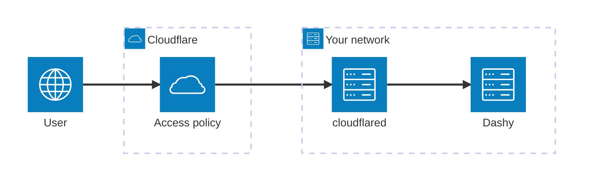
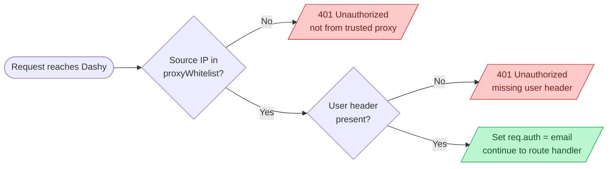
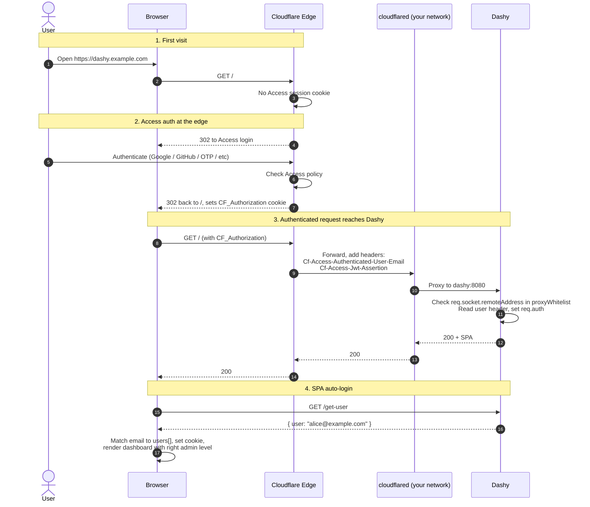

# Cloudflare Tunnel

Dashy works well behind [Cloudflare Tunnel](https://developers.cloudflare.com/cloudflare-one/connections/connect-networks/) with [Cloudflare Access](https://developers.cloudflare.com/cloudflare-one/policies/access/) doing auth at the edge. This is one of the most common ways to expose a homelab dashboard to the public internet without opening any inbound ports, without managing TLS, and without standing up your own identity provider.

The flow: Cloudflare authenticates the user (via Google, GitHub, email OTP, etc.) at the edge, signs an identity into request headers, and forwards the request to a `cloudflared` daemon you run on your network. `cloudflared` proxies to Dashy. Dashy reads the email from the header and matches the user against its config.

### Contents

- [1. How it fits together](#1-how-it-fits-together)
- [2. Create the tunnel in Cloudflare](#2-create-the-tunnel-in-cloudflare)
- [3. Run cloudflared](#3-run-cloudflared)
- [4. Add a Cloudflare Access policy](#4-add-a-cloudflare-access-policy)
- [5. Configure Dashy](#5-configure-dashy)
- [6. Best practices](#6-best-practices)
- [Troubleshooting](#troubleshooting-common-cloudflare-tunnel-issues)
- [How it Works](#how-it-works)

## 1. How it fits together

Three Cloudflare pieces, plus Dashy on your side:
- Cloudflare Tunnel exposes Dashy to the public internet over an outbound-only connection. No port forwarding, no inbound firewall rules
- Cloudflare Access sits in front of the tunnel and enforces an identity policy. Anyone reaching the tunnel has already authenticated to Cloudflare
- `cloudflared` is the daemon you run alongside Dashy. It dials out to Cloudflare and forwards authenticated requests to Dashy's local port
- Dashy's header auth reads the email Cloudflare sets in `Cf-Access-Authenticated-User-Email` and matches it to a user




You need:
- A Cloudflare account
- A domain on Cloudflare (any TLD, free plan is fine)
- Docker (or any way to run `cloudflared`)
- Free tier covers up to 50 Access users

## 2. Create the tunnel in Cloudflare

Cloudflare's dashboard handles most of this.

1. Go to [Zero Trust dashboard](https://one.dash.cloudflare.com)
2. Open **Networks > Tunnels**
3. Click **Create a tunnel**
4. Pick **Cloudflared** as the connector, click **Next**
5. Name it (e.g. `homelab`), click **Save tunnel**
6. Copy the **tunnel token** shown on the install screen. You'll paste this into Docker compose in the next step. Keep it secret, it grants tunnel access
7. Click **Next** without installing the package on the host (Docker is easier)
8. Add a **Public hostname**:
   - **Subdomain**: e.g. `dashy`
   - **Domain**: your Cloudflare domain
   - **Type**: `HTTP`
   - **URL**: `dashy:8080` (the in-network service name + port Dashy listens on)
9. Click **Save**

Cloudflare now routes `https://dashy.example.com` through the tunnel to your `cloudflared` daemon, which forwards to `dashy:8080` on whatever Docker network they share.

## 3. Run cloudflared

A minimal compose with Dashy + `cloudflared` together:

<details>
    <summary>Example <code>docker-compose.yml</code></summary>

```yaml
name: dashy-cfaccess

services:
  cloudflared:
    image: cloudflare/cloudflared:latest
    restart: unless-stopped
    command: tunnel --no-autoupdate run
    environment:
      TUNNEL_TOKEN: ${CLOUDFLARE_TUNNEL_TOKEN}
    depends_on:
      dashy:
        condition: service_healthy

  dashy:
    image: lissy93/dashy:4.1.5
    restart: unless-stopped
    environment:
      NODE_ENV: production
      HOST: 0.0.0.0
      PORT: 8080
    volumes:
      - ./user-data:/app/user-data
    healthcheck:
      test: ["CMD-SHELL", "wget -qO- http://127.0.0.1:8080/healthz >/dev/null 2>&1"]
      interval: 10s
      timeout: 5s
      retries: 10
      start_period: 30s
```

</details>

Set the token via env or a `.env` file alongside the compose:

```env
CLOUDFLARE_TUNNEL_TOKEN=eyJhIjoiMDF...rest-of-token
```

Bring it up:

```bash
docker compose up -d
```

Notice what's not in the compose: Dashy has no `ports:` mapping. It's only reachable from inside the Docker network, which means only `cloudflared` can talk to it. That's the first half of the security model.

## 4. Add a Cloudflare Access policy

Without Access, the tunnel is open to anyone who knows the URL. Add a policy so Cloudflare enforces auth at the edge.

1. In Zero Trust, open **Access > Applications**
2. Click **Add an application**
3. Choose **Self-hosted**
4. Set **Application name** to `Dashy`
5. Set **Session duration** to whatever feels right (e.g. 24 hours)
6. Under **Application domain**, pick the subdomain and domain you used in step 2 (`dashy.example.com`)
7. Click **Next**
8. Add a policy:
   - **Policy name**: `Trusted users`
   - **Action**: `Allow`
   - **Include**: `Emails ending in @example.com`, or `Emails` with specific addresses, or `Everyone` for open access
9. Optionally add a second policy for admins with stricter rules
10. Click **Next** and **Add application**

Cloudflare now bounces anyone visiting `https://dashy.example.com` to its login page first, only forwarding the request after auth.

## 5. Configure Dashy

In `/user-data/conf.yml`:

```yaml
appConfig:
  ...
  disableConfigurationForNonAdmin: true
  auth:
    enableHeaderAuth: true
    users:
      - user: admin@example.com
        hash: "0000000000000000000000000000000000000000000000000000000000000000"
        type: admin
      - user: user@example.com
        hash: "0000000000000000000000000000000000000000000000000000000000000000"
        type: normal
    headerAuth:
      userHeader: Cf-Access-Authenticated-User-Email
      proxyWhitelist:
        - 172.18.0.2
```

Where:
- `enableHeaderAuth` - Turns on header auth mode
- `users` - Required. The email the proxy sends must match `user` here for the user to be admitted. The `type` field controls admin status in Dashy
- `hash` - Required by Dashy's user schema even though the password is never checked under header auth. Quote it to stop YAML parsing the all-zero placeholder as the number 0
- `userHeader` - The header Cloudflare Access sets after a user authenticates. Matches case-insensitively
- `proxyWhitelist` - Required. The IP `cloudflared` connects from. Find it with `docker compose exec dashy getent hosts cloudflared` or check `docker network inspect`. This is the single biggest control: requests from any other IP get 401 before headers are even read

Restart Dashy after editing.

Open `https://dashy.example.com`. Cloudflare bounces you to its login page, you authenticate, and you land on the Dashy dashboard auto-logged-in as that email.

## 6. Best practices

- Don't bind Dashy's port to the host. Only `cloudflared` should reach it, which is the case if you leave the `ports:` block out of the dashy service
- Treat the tunnel token as a credential. Anyone with it can connect a `cloudflared` to your tunnel and impersonate it
- Set `proxyWhitelist` to the smallest possible set of IPs. For Docker compose that's typically just the one `cloudflared` container address
- Pin `cloudflared` to a version tag in production rather than `:latest`. Cloudflare updates the daemon often
- Configure Access policies before public release. A tunnel without an Access policy is wide open
- Use Access groups in the dashboard for "who is an admin" rather than relying solely on Dashy's `type: admin`, so identity changes don't require redeploying Dashy
- For machine-to-machine access (CI, healthchecks, monitoring), use Access [Service Tokens](https://developers.cloudflare.com/cloudflare-one/identity/service-tokens/) and a separate bypass policy keyed on the token. Don't try to share user credentials
- If Dashy and `cloudflared` aren't on the same Docker network, force them on one with an explicit `networks:` block

## Troubleshooting common Cloudflare Tunnel issues

#### 401 Unauthorized from Dashy after the Cloudflare login screen
Problem: You authenticate at Cloudflare, get redirected to Dashy, but see "Unauthorized - not from trusted proxy".<br>
Solution: `proxyWhitelist` doesn't include `cloudflared`'s container IP. Run `docker compose exec dashy getent hosts cloudflared` to find it, paste that IP into `proxyWhitelist`, restart Dashy.

#### "Unauthorized - missing user header"
Problem: Server logs show that header auth ran but the user header was empty.<br>
Solution: The request reached Dashy from a trusted IP but without `Cf-Access-Authenticated-User-Email`. This usually means the tunnel doesn't have an Access policy in front of it, so traffic is reaching Dashy unauthenticated. Open the Access application in Zero Trust and confirm there's at least one policy attached.

#### User logs in but admin features stay locked
Problem: You authenticate, the dashboard renders, but Save Config and other admin actions are disabled.<br>
Solution: The email Cloudflare sends must exactly match a `users[].user` entry with `type: admin`. Check the JWT in `Cf-Access-Jwt-Assertion` (decode at [jwt.io](https://jwt.io)) to see the actual email Cloudflare is sending. Often a personal Google account vs work account mismatch.

#### Loop or repeated redirects to the Cloudflare login page
Problem: Each refresh bounces back through Cloudflare's login.<br>
Solution: Session cookies are being blocked or stripped. Check that the tunnel's public hostname uses HTTPS (it does by default), that no upstream proxy strips third-party cookies, and that the Access application's session duration is non-zero.

#### Stuck on a cached page after the Access session expires
Problem: You have the service worker enabled (`appConfig.enableServiceWorker`), and once your Access session expires Dashy keeps showing a broken cached page instead of redirecting to the Cloudflare login.<br>
Solution: Set `appConfig.enableAuthProxyCompat: true`. Dashy will then detect the expiry on load and reload so Cloudflare can redirect you to log in again.

#### "Critical Configuration Load Error" on first load
Problem: SPA errors out before showing the dashboard.<br>
Solution: Usually a CORS or network reachability issue, but for Cloudflare Tunnel this is most often a `cloudflared` to `dashy` networking problem inside Docker. `docker compose logs cloudflared` will show connection attempts. Confirm both services are on the same Docker network and that the tunnel's public hostname URL matches the service name and port (e.g. `dashy:8080`, not `localhost:8080`).

#### cloudflared can't connect to the tunnel
Problem: `cloudflared` keeps logging connection errors.<br>
Solution: Check the token. Tokens are tunnel-specific, and rotating one in the dashboard invalidates the previous one. If you recreated the tunnel, paste the new token into `.env` and restart.

#### Schema warning "hash must be string" on Dashy startup
Problem: Dashy logs warn about user hashes not being strings.<br>
Solution: YAML parsed an all-zeros (or all-digit) hash as a number. Wrap the value in quotes: `hash: "0000..."` rather than `hash: 0000...`.

#### Want to bypass Cloudflare Access for automation
Problem: A monitoring or CI agent needs to hit `/healthz` or scrape Dashy, but Cloudflare Access blocks it.<br>
Solution: In the Access application, add a Service Token, then create a Bypass policy keyed on that token. The agent sends `Cf-Access-Client-Id` and `Cf-Access-Client-Secret` headers to authenticate as a machine. Don't share user logins.

---

## How it Works

### Server side

When Dashy has `enableHeaderAuth: true`, [`services/app.js`](https://github.com/lissy93/dashy/blob/4.1.5/services/app.js) installs a small middleware in front of every API and asset route. The middleware does two things per request:

- Check `req.socket.remoteAddress` against `proxyWhitelist`. If the source IP isn't in the list, return 401 immediately. The header is never even inspected
- Read the header named by `userHeader` (case-insensitive). If empty, return 401. Otherwise set `req.auth = { user: <email> }` and let the request through

The IP check is the security boundary. Cloudflare adds `Cf-Access-Authenticated-User-Email` only after a successful Access policy match, and `cloudflared` is the only thing that can talk to Dashy (no exposed port). So the only way that header can be set on a request reaching Dashy is via the Cloudflare to cloudflared to dashy path, after a real Cloudflare Access authentication.

The SPA fetches `/get-user` once on load, which returns whatever email the server saw. The client-side code in [`src/utils/auth/HeaderAuth.js`](https://github.com/lissy93/dashy/blob/4.1.5/src/utils/auth/HeaderAuth.js) matches that email against the configured `users[]` to determine `type: admin` vs `normal`, then sets the session cookie. The route guard in [`src/router.js`](https://github.com/lissy93/dashy/blob/4.1.5/src/router.js) skips its usual `/login` bounce when `enableHeaderAuth` is on, since the SPA can't tell "not logged in" from "header auth still resolving" and the server is authoritative anyway.

#### Server-side auth middleware




<details>

<summary>End-to-end authentication flow</summary>



</details>
