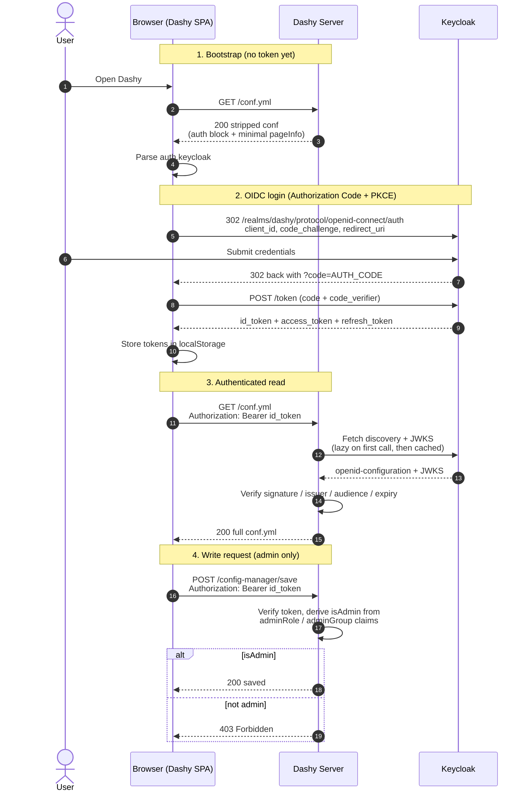
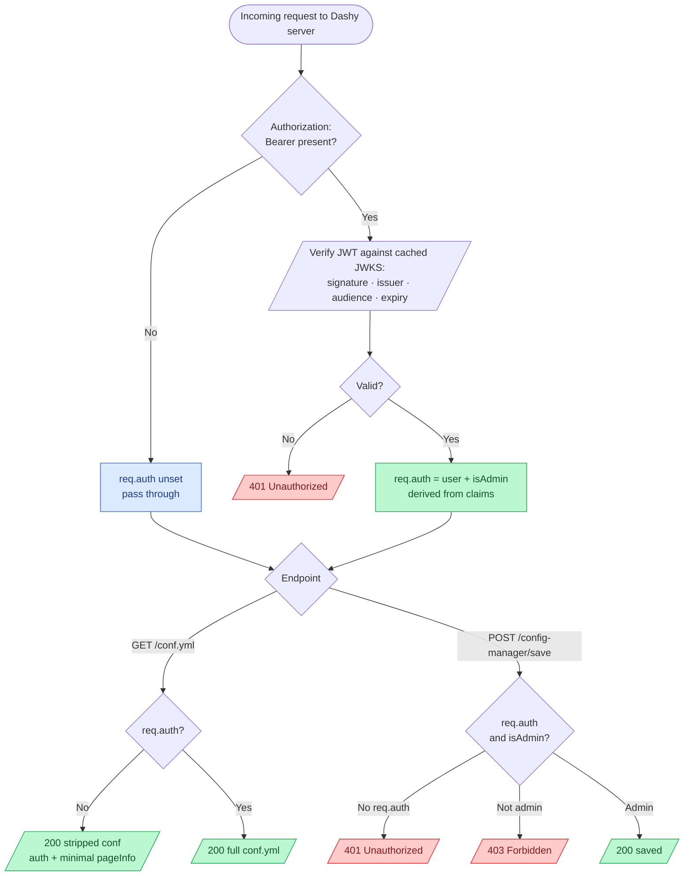

# Keycloak

Dashy supports using a [Keycloak](https://www.keycloak.org/) (V17+) authentication server.

[Keycloak](https://www.keycloak.org/about.html) is a Java-based [open source](https://github.com/keycloak/keycloak), high-performance, secure authentication system, supported by [RedHat](https://www.redhat.com/en). It can be deployed with Docker, and enables you to secure multiple self-hosted applications with single-sign-on using standard protocols (OpenID Connect, OAuth 2.0, SAML 2.0 and social login).

### Contents

- [1. Deploy Keycloak](#1-deploy-keycloak)
- [2. Configure Keycloak](#2-configure-keycloak)
- [3. Enabling Keycloak in Dashy](#3-enabling-keycloak-in-dashy)
- [4. Groups and Roles](#4-groups-and-roles)
- [Troubleshooting](#troubleshooting-common-keycloak-issues)
- [How it Works](#how-it-works)

## 1. Deploy Keycloak

If you've not already done so, spin up a Keycloak instance.
You can do this by following the [Keycloak Docs](https://www.keycloak.org/guides.html#getting-started), or use the following Docker examples:

```bash
docker run -d \
  -p 9100:8080 \
  --name keycloak \
  -e KEYCLOAK_ADMIN=kc-admin \
  -e KEYCLOAK_ADMIN_PASSWORD=KeycloakAdmin2026! \
  quay.io/keycloak/keycloak:25.0 start-dev
```

<details>
    <summary>Example <code>docker-compose.yml</code></summary>

```env
KEYCLOAK_ADMIN=kc-admin
KEYCLOAK_ADMIN_PASSWORD=KeycloakAdmin2026!
```

```yaml
name: dashy-keycloak
services:
  keycloak:
    image: quay.io/keycloak/keycloak:25.0
    command:
      - start-dev
      - --http-port=9100
      - --hostname-strict=false
      - --health-enabled=true
    restart: unless-stopped
    ports:
      - "9100:9100"
      - "4000:8080"
    volumes:
      - keycloak-data:/opt/keycloak/data
    environment:
      KEYCLOAK_ADMIN: ${KEYCLOAK_ADMIN}
      KEYCLOAK_ADMIN_PASSWORD: ${KEYCLOAK_ADMIN_PASSWORD}
      KC_HTTP_ENABLED: "true"
      KC_HOSTNAME_STRICT: "false"
      KC_HEALTH_ENABLED: "true"
    healthcheck:
      test: ["CMD-SHELL", "timeout 2 bash -c '</dev/tcp/127.0.0.1/9100'"]
      start_period: 30s
      interval: 10s
      timeout: 5s
      retries: 15

  dashy:
    image: lissy93/dashy:4.1.0
    network_mode: service:keycloak
    restart: unless-stopped
    depends_on:
      keycloak:
        condition: service_healthy
    environment:
      NODE_ENV: production
      HOST: 0.0.0.0
      PORT: 8080
    volumes:
      - ./user-data:/app/user-data
    healthcheck:
      test: ["CMD-SHELL", "wget -qO- http://127.0.0.1:8080/healthz >/dev/null 2>&1"]
      start_period: 30s
      interval: 10s
      timeout: 5s
      retries: 15

volumes:
  keycloak-data:
```

</details>

You should now be able to access the Keycloak web interface at `http://127.0.0.1:9100`, log in with your admin credentials above, and create a new password when prompted.

---

## 2. Configure Keycloak

### Create the Keycloak realm
1. Open `http://localhost:9100`.
2. Click **Administration Console**.
3. Log in as `kc-admin`.
4. Open the realm selector in the top-left.
5. Click **Create realm**.
6. Set **Realm name** to `dashy`.
7. Click **Create**.

### Allow Dashy's local origin
1. In the `dashy` realm, open **Realm settings**.
2. Open **Security defenses**.
3. Open **Headers**.
4. Clear **X-Frame-Options**.
5. Set **Content-Security-Policy** to:

```text
frame-src 'self' http://localhost:4000 http://127.0.0.1:4000; frame-ancestors 'self' http://localhost:4000 http://127.0.0.1:4000; object-src 'none';
```

6. Click **Save**.

> If Dashy and Keycloak are served from the same origin in production, you can skip this step. Clearing X-Frame-Options and allow-listing origins is only needed when Dashy frames Keycloak's `check-sso` iframe across origins, as in this localhost setup.

### Create the Dashy client
1. In the `dashy` realm, open **Clients**.
2. Click **Create client**.
3. Set **Client type** to `OpenID Connect`.
4. Set **Client ID** to `dashy`.
5. Click **Next**.
6. Turn **Client authentication** off. Dashy is a SPA using PKCE, so it must be a public client.
7. Leave **Standard flow** on.
8. Leave **Direct access grants** on or off; Dashy does not require it.
9. Click **Next**.
10. Set **Valid redirect URIs** to:
    - `http://localhost:4000/*`
    - `http://127.0.0.1:4000/*`
11. Set **Valid post logout redirect URIs** to:
    - `http://localhost:4000/*`
    - `http://127.0.0.1:4000/*`
12. Set **Web origins** to:
    - `http://localhost:4000`
    - `http://127.0.0.1:4000`
13. Click **Save**.


### Add the realm-role mapper

Dashy uses `adminRole: dashy-admin` in `user-data/conf.yml`. For server-side admin checks to work, Keycloak must include realm roles in the ID token

1. Open **Clients**
2. Click the `dashy` client
3. Open **Client scopes**
4. Click the dedicated scope row, usually named `dashy-dedicated`
5. Click **Add mapper**
6. Click **By configuration**
7. Select **User Realm Role**
8. Set **Name** to `dashy-realm-roles`
9. Set **Token Claim Name** to `realm_access.roles`
10. Turn **Multivalued** on
11. Turn **Add to ID token** on
12. Turn **Add to access token** on
13. Turn **Add to userinfo** on
14. Click **Save**

### Create the Dashy admin role
1. In the `dashy` realm, open **Realm roles**
2. Click **Create role**
3. Set **Role name** to `dashy-admin`
4. Click **Save**

### (Alternative) Use a group for admin

To grant admin via group membership instead of a realm role, add a second mapper of type *Group Membership* with claim name `groups`, create the group under *Groups*, assign your admin users to it, then set `adminGroup: <group-name>` (in place of `adminRole`) in your Dashy config later.

### Create test users

> On Keycloak 25 and newer, **First name** and **Last name** are required by the default user-profile schema. Skip them and the user can authenticate, but login then fails with "Account is not fully set up". The steps below set both.

Create an admin user:
1. Open **Users**
2. Click **Add user**
3. Set **Username** to `keycloak-admin`
4. Set **Email verified** to on
5. Set **First name** to `Keycloak`
6. Set **Last name** to `Admin`
7. Click **Create**
8. Open the **Credentials** tab
9. Click **Set password**
10. Set a password, turn **Temporary** off, and save it
11. Open the **Role mapping** tab
12. Click **Assign role**
13. Filter by realm roles, select `dashy-admin`, and assign it

Create a normal user:
1. Open **Users**
2. Click **Add user**
3. Set **Username** to `keycloak-user`
4. Set **Email verified** to on
5. Set **First name** to `Keycloak`
6. Set **Last name** to `User`
7. Click **Create**
8. Open the **Credentials** tab
9. Set a non-temporary password
10. Do not assign `dashy-admin`

### Summary

Keycloak should now be configured, and ready to go!

The Keycloak UI is not super intuitive, so if you're struggling to find where to configure any of the above options, below is a full start-to-end walkthrough video:

https://github.com/user-attachments/assets/12b6a596-1ec6-453a-9ff7-d4e2c3aa69f7

If you need to, you can make a backup of your Keycloak config, with their built-in backup tool. Something like:

```bash
docker compose run --rm --no-deps \
  -v ./backup:/backup \
  keycloak export \
  --realm dashy \
  --dir /backup \
  --users realm_file \
  --optimized
```

Here's an example of a configured [`dashy-realm.json`](https://github.com/user-attachments/files/27861822/dashy-realm.json) backup.

---

## 3. Enabling Keycloak in Dashy

Finally, you need to tell Dashy to use the new Keycloak setup, and only allow access from authorized Keycloak users. This is done in the `appConfig.auth` section of your main `/user-data/conf.yml` file.

As an example, you can view this [`conf.yml`](https://github.com/user-attachments/files/27861628/conf.yml), which is fully-configured with Keycloak auth using the info from the above steps.

```yaml
appConfig:
  ...
  disableConfigurationForNonAdmin: true
  auth:
    enableKeycloak: true
    keycloak:
      serverUrl: http://localhost:9100
      realm: dashy
      clientId: dashy
      adminRole: dashy-admin
```

Where:
- `disableConfigurationForNonAdmin` - Prevent read/write config access to non-admin Keycloak users
- `auth.enableKeycloak` - Set the auth mode to Keycloak
- `serverUrl` - The host (no paths) to your Keycloak instance, accessible from the Dashy container
- `realm` - The name (case sensitive) of the Keycloak realm to use
- `clientId` - Client ID that you created for Dashy
- `adminRole` - The role name that grants admin
- `adminGroup` - (Alternative to `adminRole`) Group name that grants admin
- `idpHint` - (Optional) Alias of an external IdP federated through Keycloak; skips the Keycloak login page and redirects straight to that provider

Note that a restart is required for these changes to take effect.

If Keycloak runs on a different host or behind a reverse proxy, make sure `serverUrl` is reachable from inside the Dashy container, and that the realm's redirect URIs and Web Origins match Dashy's public URL.

Everything should now be fully configured and working 🎉<br>
Now, when you load Dashy, you'll be redirected to your Keycloak login page, after logging in you will then land back on Dashy's homepage with full access! Until you're authenticated, Dashy's config and API endpoints return a 401 (a write attempt by a non-admin returns a 403).

---

## 4. Groups and Roles

Keycloak allows you to assign users roles and groups. Dashy supports using these roles, to configure who can access various sections or items in Dashy's frontend.

For example, to make any given section only visible to admins, simply add the following to the section's `displayData` section:

```yaml
displayData:
  showForKeycloakUsers:
    roles:
      - dashy-admin # ID of the admin role you created earlier
```

Keycloak server administration and configuration is a deep topic; please refer to the [server admin guide](https://www.keycloak.org/docs/latest/server_admin/index.html#assigning-permissions-and-access-using-roles-and-groups) to see details about creating and assigning roles and groups.

Once you have groups or roles assigned to users you can configure access under each section or item `displayData.showForKeycloakUsers` and `displayData.hideForKeycloakUsers`.

Both show and hide configurations accept a list of `groups` and `roles` that limit access. If a users data matches one or more items in these lists they will be allowed or excluded as defined.

```yaml
sections:
  - name: DeveloperResources
    displayData:
      showForKeycloakUsers:
        roles: ['canViewDevResources']
      hideForKeycloakUsers:
        groups: ['ProductTeam']
    items:
      - title: Not Visible for developers
        displayData:
          hideForKeycloakUsers:
            groups: ['DevelopmentTeam']
```

---

## Troubleshooting common Keycloak Issues

#### Client Authentication Issue
Problem: Redirect loop, if client authentication is enabled.<br>
Solution: Switch off "Client authentication" in the dashy client's "Advanced" settings.

#### Double URL
Problem: If you get redirected to "https://dashy.my.domain/#iss=https://keycloak.my.domain/realms/dashy"<br>
Solution: Turn on "Exclude Issuer From Authentication Response" in the dashy client's "Advanced" -> "OpenID Connect Compatibility Modes".

#### Problems with multiple Dashy Pages
Problem: Refreshing or logging out of dashy results in an "invalid_redirect_uri" error.<br>
Solution: In the dashy client's "Access settings", set "Root URL" to https://dashy.my.domain/, and make sure the valid redirect URIs end in /*.

#### 403 on login-status-iframe.html/init
Problem: Browser console shows a 403 from Keycloak when the SPA loads.<br>
Solution: Open the dashy client's "Web origins" and remove any trailing `/*`. Web Origins must be bare origins (e.g. http://localhost:4000), not http://localhost:4000/*.

#### CSP error for /3p-cookies/step1.html or "Authentication failed (Keycloak)"
Problem: The hidden Keycloak iframe is blocked by frame-ancestors.<br>
Solution: In the dashy realm (not master), open Realm settings -> Security defenses -> Headers. Clear X-Frame-Options and set the Content-Security-Policy as described earlier in this section.

#### Dashy server can't reach Keycloak
Problem: SPA loads fine but every authenticated API call returns 401, and the Dashy server logs show `[auth-oidc] token verification failed` or fetch errors for `.well-known/openid-configuration`.<br>
Solution: `serverUrl` must be reachable from inside the Dashy container, not just from the browser. In Docker, put both services on the same network and use the service name (e.g. `http://keycloak:8080`). Test with `docker exec <dashy-container> wget -qO- "$SERVER_URL/realms/dashy/.well-known/openid-configuration"`.

#### Logged in but config saves return 403
Problem: User authenticates fine, but saving the dashboard returns 403.<br>
Solution: The id_token doesn't carry the admin claim. Confirm the *Add to ID token* toggle on the Step 2 mapper is on. Paste the token (from localStorage, key `ID_TOKEN`) into [jwt.io](https://jwt.io) and look for `realm_access.roles` (or `groups` if you're using `adminGroup`).

#### Issuer mismatch behind a reverse proxy
Problem: Server logs show `unexpected "iss" claim value`. The browser reaches Keycloak over HTTPS but Keycloak advertises an HTTP issuer in its discovery document.<br>
Solution: Set `KC_HOSTNAME=<public-host>` on Keycloak so the issuer matches the public URL, and ensure your reverse proxy forwards `X-Forwarded-Proto: https`.

#### Audience mismatch on token verification
Problem: Server logs show `unexpected "aud" claim value`. Every auth'd API call returns 401.<br>
Solution: `clientId` in `conf.yml` must exactly match the Keycloak client's Client ID. Check for trailing whitespace, case mismatches, or accidentally using the client's internal UUID instead of the Client ID string.

#### Self-signed Keycloak certificate rejected
Problem: Dashy server logs show TLS errors (`self-signed certificate`, `UNABLE_TO_VERIFY_LEAF_SIGNATURE`) when fetching JWKS or discovery.<br>
Solution: Use a real certificate on Keycloak (Let's Encrypt, or your homelab CA), or mount your CA bundle into the Dashy container and set `NODE_EXTRA_CA_CERTS=/path/to/ca.pem`.

#### Token expired / clock skew
Problem: 401s with `"exp" claim timestamp check failed` or `"iat" claim timestamp check failed`, even just after login.<br>
Solution: Dashy allows 30 seconds of drift. Sync clocks on both hosts with NTP. Container clocks follow their host, so it's almost always the host that's drifted.

#### Mixed content blocked by the browser
Problem: Dashy served over HTTPS, Keycloak over HTTP. The browser blocks the token or JWKS endpoint with a mixed-content error.<br>
Solution: Terminate both behind HTTPS. For local testing, use HTTP on both, but never mix schemes in the same flow.

#### Numeric Client ID truncated
Problem: Token verification fails with audience mismatch when `clientId` in `conf.yml` is a long numeric string.<br>
Solution: Wrap numeric Client IDs in quotes (e.g. `clientId: "12345678901234567"`). Without quotes YAML parses the value as a JS number and loses precision past about 15 digits.

#### Logout lands on a broken page
Problem: Clicking Logout in Dashy ends on a Keycloak error or 404 instead of returning to Dashy.<br>
Solution: Add Dashy's URL to **Valid post logout redirect URIs** on the `dashy` client. Keycloak v18+ requires registered, exact-match post-logout URIs.

#### check-sso hangs in strict browsers
Problem: First load spins indefinitely. Browser console reports blocked third-party cookies. Common in Safari, Brave, or Firefox with strict tracking protection.<br>
Solution: Serve Dashy and Keycloak under the same registrable domain (e.g. `dashy.example.com` and `auth.example.com`) so the session cookie is first-party.

#### Config change to auth.keycloak not picked up
Problem: Updated `serverUrl`, `realm`, `clientId`, `adminRole`, or `adminGroup` in `conf.yml`, but Dashy still authenticates against the old values.<br>
Solution: The server reads the auth config only at boot. Restart the Dashy container after any change to fields under `auth.keycloak`.

---

## How it Works

If you're a developer or contributor looking to understand or make changes to Dashy's Keycloak implementation, the following outlines how it's wired together.

The same OIDC pipeline backs both Keycloak and generic OIDC providers. The only Keycloak-specific code is the SPA adapter, which uses `keycloak-js` so it can take advantage of `check-sso` and silent token renewal.

### Client side

Boot starts in [`src/main.js`](https://github.com/lissy93/dashy/blob/4.1.5/src/main.js). After the initial `/conf.yml` fetch parses the auth block, `isKeycloakEnabled()` decides whether to lazily import `keycloak-js` and call `initKeycloakAuth()`.

[`src/utils/auth/KeycloakAuth.js`](https://github.com/lissy93/dashy/blob/4.1.5/src/utils/auth/KeycloakAuth.js) wraps the adapter. On load it calls `keycloakClient.init({ onLoad: 'check-sso', responseMode: 'query' })`. If a Keycloak session already exists the user is silently authenticated; otherwise the SPA redirects to the login page with PKCE. On return, `storeKeycloakInfo()` persists the raw `id_token`, the user's `groups` and `roles`, `preferred_username`, and a derived `isAdmin` flag to localStorage, then hard-redirects to `/` so the SPA boots a second time with the Bearer token in place.

[`src/utils/auth/getApiAuthHeader.js`](https://github.com/lissy93/dashy/blob/4.1.5/src/utils/auth/getApiAuthHeader.js) builds the Authorization header for every internal API call. It does a client-side `exp` check and returns `null` for missing or expired tokens, so the next request triggers a fresh login rather than a 401.

The localStorage keys (`ID_TOKEN`, `KEYCLOAK_INFO`, `USERNAME`, `ISADMIN`) live in [`src/utils/config/defaults.js`](https://github.com/lissy93/dashy/blob/4.1.5/src/utils/config/defaults.js). [`src/utils/IsVisibleToUser.js`](https://github.com/lissy93/dashy/blob/4.1.5/src/utils/IsVisibleToUser.js) reads `KEYCLOAK_INFO` when evaluating `showForKeycloakUsers` and `hideForKeycloakUsers` rules.

### Server side

[`services/auth-oidc.js`](https://github.com/lissy93/dashy/blob/4.1.5/services/auth-oidc.js) contains the entire server-side auth surface, in five small pieces:

- `loadOidcSettings()` reads `auth.keycloak` (or `auth.oidc`) at boot and returns a normalised `{ issuer, clientId, adminGroup, adminRole }`. For Keycloak the issuer is `<serverUrl>/realms/<realm>`.
- `createOidcMiddleware()` returns a Connect middleware. Permissive on no-token requests so the SPA can bootstrap; otherwise it verifies the Bearer token against the realm's JWKS using [`jose`](https://github.com/panva/jose). Checks cover signature, issuer (against the canonical value from the discovery doc), audience (must equal `clientId`), and expiry, with a 30-second clock-skew tolerance. Sets `req.auth = { user, isAdmin, claims }` on success, `401` on failure.
- `getIssuerContext()` lazily fetches `.well-known/openid-configuration` on first use and wraps `jwks_uri` in `createRemoteJWKSet`, which handles JWKS caching and on-demand key rotation. The result is memoised per-issuer for the life of the process.
- `deriveIsAdmin()` checks the token's `groups` claim against `adminGroup`, and the union of `realm_access.roles` and `resource_access.<clientId>.roles` against `adminRole`. Either match returns true.
- `maybeBootstrapConfig()` is the stripped-response helper. When auth is configured, guest access is off, and an unauthenticated request hits the root `/conf.yml`, it returns a minimal copy with only `appConfig.auth`, `appConfig.enableServiceWorker`, and a `pageInfo.title` of `Login | <your title>`. Sections, items, hostnames and any other secrets never leave the server.

[`services/app.js`](https://github.com/lissy93/dashy/blob/4.1.5/services/app.js) wires it all together. The middleware mounts as `protectConfig` in front of every YAML route and config-mutating route. The `/*.yml` handler sets `Cache-Control: private, no-store` and `Vary: Authorization` whenever auth is configured (so intermediate caches can never mix auth states), then calls `maybeBootstrapConfig`; a stripped result is sent as-is, otherwise `res.sendFile` serves the full file. `POST /config-manager/save` is additionally guarded by `requireAdmin`, which returns `401` if `req.auth` is unset and `403` if `req.auth.isAdmin` is false.

### Why the mapper matters

The server's admin check reads from the `id_token` only. Keycloak's default mapper adds realm roles to the access token but not the id token, so without the Step 2 *Add to ID token* toggle, `realm_access.roles` is absent and every user is treated as non-admin. The same applies to `groups` if you use `adminGroup` instead. This is the single most common cause of "logged in fine, but can't save changes".

### Visual Overview

<details>

<summary>End-to-end authentication flow</summary>



</details>


<details>

<summary>Server-side request handling</summary>



</details>
