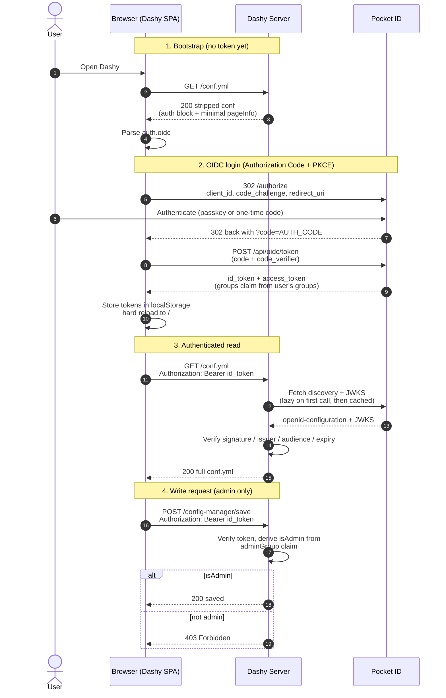
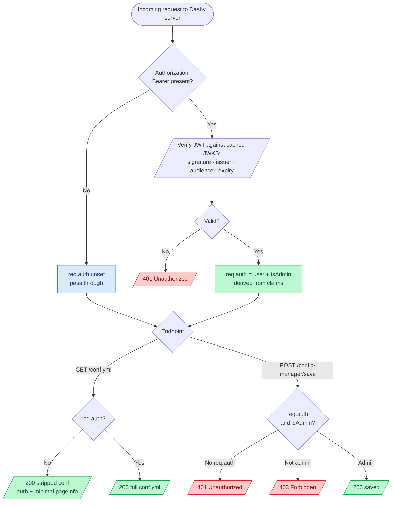

# Pocket ID OIDC

Dashy supports using [Pocket ID](https://pocket-id.org/) as its OIDC provider.

[Pocket ID](https://pocket-id.org/) is a small [open source](https://github.com/pocket-id/pocket-id) identity provider built around passkeys. It's a single Go binary backed by SQLite (or Postgres if you want), no password storage, no email server needed for basic use. Popular in homelab setups where you want SSO across a handful of services without running Authentik or Keycloak.

### Contents

- [1. Deploy Pocket ID](#1-deploy-pocket-id)
- [2. Configure Pocket ID](#2-configure-pocket-id)
  - [First-time admin setup](#first-time-admin-setup)
  - [Create the OIDC client](#create-the-oidc-client)
  - [Create the admin group](#create-the-admin-group)
  - [Create test users](#create-test-users)
- [3. Enabling Pocket ID in Dashy](#3-enabling-pocket-id-in-dashy)
- [4. Groups and Visibility](#4-groups-and-visibility)
- [5. Silent token renewal (optional)](#5-silent-token-renewal-optional)
- [Troubleshooting](#troubleshooting-common-pocket-id-issues)
- [How it Works](#how-it-works)
  - [Client side](#client-side)
  - [Server side](#server-side)
  - [Visual Overview](#visual-overview)

## 1. Deploy Pocket ID

A minimal compose:

<details>
    <summary>Example <code>docker-compose.yml</code></summary>

```yaml
name: dashy-pocketid

services:
  pocket-id:
    image: ghcr.io/pocket-id/pocket-id:v2.7.0
    restart: unless-stopped
    ports:
      - "1411:1411"
    environment:
      APP_URL: http://localhost:1411
      TRUST_PROXY: "false"
      DB_PROVIDER: sqlite
      DB_CONNECTION_STRING: /data/pocket-id.db
      ENCRYPTION_KEY: "local-dev-key-32-bytes-padding!!"
    volumes:
      - ./data:/data
    healthcheck:
      test: ["CMD", "wget", "-qO-", "http://127.0.0.1:1411/healthz"]
      interval: 10s
      timeout: 5s
      retries: 10
      start_period: 30s
```

</details>

A few things worth understanding before you start:

- `APP_URL` is the URL the browser uses to reach Pocket ID. It must match exactly, since Pocket ID puts that value in the OIDC issuer, in cookie domains, and in the WebAuthn relying party
- `ENCRYPTION_KEY` is required and must be at least 16 bytes. Generate a real one with `openssl rand -hex 32` for production; the example above is for local testing only
- Pocket ID is passkey-only by default. Passkeys (WebAuthn) require a secure context, which means either HTTPS, or a literal `localhost` host. `pocketid.lvh.me` and similar lookalikes don't qualify, only the exact string `localhost`. For production use HTTPS with a real domain; for local testing stick to `http://localhost`

For production:

- Put Pocket ID behind a reverse proxy with HTTPS on a real domain
- Set `APP_URL: https://auth.example.com`
- Set `TRUST_PROXY: "true"` so it honours forwarded headers
- Use a 32-byte random `ENCRYPTION_KEY`
- Consider swapping `DB_PROVIDER` to `postgres` for redundancy

Bring Pocket ID up:

```bash
docker compose up -d pocket-id
```

Wait for it to be healthy (`curl -sf http://localhost:1411/healthz`), then continue.

---

## 2. Configure Pocket ID

### First-time admin setup

There's no env-var bootstrap. You create the first admin through the UI, or via SQLite if you want to script it.

Through the UI:

1. Open `http://localhost:1411` in a browser
2. The setup wizard prompts for a first admin (username, email, name)
3. After creating the user, register a passkey when prompted

If you can't easily register a passkey (no compatible device, or running headless), insert the admin user via SQLite and then use the CLI to get a one-time login URL:

```bash
docker compose exec pocket-id sh -c '
  apk add --no-cache sqlite >/dev/null 2>&1
  sqlite3 /data/pocket-id.db "
    INSERT INTO users (id, created_at, updated_at, username, email, first_name, last_name, display_name, is_admin, email_verified)
    VALUES (\"admin-uuid-001\", datetime(\"now\"), datetime(\"now\"), \"pocketid-admin\", \"admin@example.com\", \"Pocket ID\", \"Admin\", \"Admin\", 1, 1);
  "
'

docker compose exec pocket-id /app/pocket-id one-time-access-token pocketid-admin
```

The CLI prints a URL like `http://localhost:1411/lc/<token>`. Open it in a browser to log in. The token is single-use and expires in 1 hour. Once signed in, register a passkey under **Settings > Passkeys** so you don't need to keep generating OTA tokens.

### Create the OIDC client

1. Open **Admin > OIDC Clients**
2. Click **Add OIDC Client**
3. Set **Name** to `Dashy`
4. Set **Callback URLs** to both:
   - `http://localhost:4000`
   - `http://localhost:4000/`
5. Set **Logout Callback URLs** to `http://localhost:4000`
6. Turn **Public Client** on
7. Turn **PKCE** on
8. Click **Save**

Pocket ID generates a client ID (a UUID, e.g. `268a3701-e9ec-41f6-bad5-87c78ce87c94`). Copy it; you'll need it for Dashy's config.

### Create the admin group

1. Open **Admin > User Groups**
2. Click **Add Group**
3. Set **Name** to `Dashy admins` (or anything you like)
4. Set **Friendly name** to `admins` (this is what Pocket ID emits in the OIDC `groups` claim, and what Dashy matches against)
5. Click **Save**

### Create test users

1. Open **Admin > Users**
2. Click **Add User**
3. Fill in **Username**, **Email**, **First Name**, **Last Name**
4. Save, then optionally open the user and assign them to the `admins` group via the **Groups** tab
5. Either share the OTA URL (via the CLI command above) with the user, or have them set up a passkey on first sign-in

### Summary

Pocket ID should now have an OIDC client, an admin group, and at least one admin user in that group.

---

## 3. Enabling Pocket ID in Dashy

In `/user-data/conf.yml`:

```yaml
appConfig:
  ...
  disableConfigurationForNonAdmin: true
  auth:
    enableOidc: true
    oidc:
      clientId: 268a3701-e9ec-41f6-bad5-87c78ce87c94
      endpoint: http://localhost:1411
      adminGroup: admins
      scope: openid profile email groups
```

Where:
- `disableConfigurationForNonAdmin` - Prevent read/write config access to non-admin users
- `auth.enableOidc` - Set the auth mode to OIDC
- `clientId` - The client ID from Pocket ID. It's a UUID, so no YAML quoting needed
- `endpoint` - Pocket ID's `APP_URL`. Must match exactly. Dashy appends `/.well-known/openid-configuration` itself
- `adminGroup` - The group's **friendly name** (not the display name) that grants admin in Dashy
- `scope` - `groups` is needed for the `adminGroup` check. Pocket ID emits the claim by default when the scope is requested

Restart Dashy after editing.

If Pocket ID runs behind a reverse proxy, make sure `endpoint` and `APP_URL` agree, and that Dashy can reach `endpoint` from its container. With both services in Docker, you can either put them on the same network and use the service name, or use the host's exposed port.

Everything should now be fully configured and working 🎉
When you load Dashy, you'll be redirected to Pocket ID's sign-in page. Authenticate with your passkey (or paste a one-time code), and you'll land back on Dashy with full access. All of Dashy's client, server and asset endpoints will be locked behind authentication.

---

## 4. Groups and Visibility

Once the `groups` claim is in the id_token, you can use it to hide or show pages, sections and items. The property name is `hideForKeycloakUsers` / `showForKeycloakUsers` (the name is historical; it works for any OIDC provider, including Pocket ID).

To make an Admin section visible only to members of `admins`:

```yaml
displayData:
  showForKeycloakUsers:
    groups:
      - admins
```

Both `showForKeycloakUsers` and `hideForKeycloakUsers` accept lists of `groups` and `roles`. If a user matches an entry they're allowed or excluded as defined.

```yaml
sections:
  - name: Internal Tools
    displayData:
      showForKeycloakUsers:
        groups: ['admins']
      hideForKeycloakUsers:
        groups: ['guests']
    items:
      - title: Hidden from interns
        displayData:
          hideForKeycloakUsers:
            groups: ['interns']
```

---

## 5. Silent token renewal (optional)

By default, when your token expires Dashy sends you back through Pocket ID's login to get a new one. Set `enableSilentRenew: true` to have Dashy refresh the session quietly in the background instead, using a refresh token:

```yaml
    oidc:
      clientId: 268a3701-e9ec-41f6-bad5-87c78ce87c94
      endpoint: http://localhost:1411
      adminGroup: admins
      scope: openid profile email groups
      enableSilentRenew: true
```

Dashy adds the `offline_access` scope to its request automatically, and Pocket ID issues a refresh token for it, so nothing needs changing on the Pocket ID side. It's off by default, and if a refresh ever fails Dashy falls back to the normal sign-in. See [silent token renewal](./oidc.md#silent-token-renewal) for the full notes and caveats.


---

## Troubleshooting common Pocket ID issues

#### Pocket ID won't start, "ENCRYPTION_KEY must be at least 16 bytes long"
Problem: Container restarts on boot, logs show the encryption key error.<br>
Solution: Set `ENCRYPTION_KEY` to a string of 16 characters or more. For production generate a real random one (`openssl rand -hex 32` gives you 64 hex chars).

#### "WebAuthn is not supported in this browser"
Problem: Browser console shows the WebAuthn error and passkey registration or login fails.<br>
Solution: WebAuthn needs a secure context. Browsers grant this for HTTPS, or for the literal hostname `localhost`. `pocketid.lvh.me`, `127.0.0.1`, or anything else over HTTP won't qualify. For local testing, set `APP_URL: http://localhost:1411` and access Pocket ID via `http://localhost:1411`. For production, terminate HTTPS in front of Pocket ID.

#### "Cookie 'session' has been rejected because a non-HTTPS cookie can't be set as 'secure'"
Problem: Browser refuses to store Pocket ID's session cookie, so login appears to succeed but the next request comes back as not signed in.<br>
Solution: Same root cause as the WebAuthn one. Pocket ID always sets cookies with the `Secure` flag, which browsers will only accept on HTTPS or on `localhost`. Switch to `http://localhost` or use HTTPS.

#### One-time access token returns "Token is invalid or expired"
Problem: The CLI gave you a URL, but visiting it returns the invalid/expired error.<br>
Solution: OTA tokens are single-use and expire after 1 hour. If you've already used the URL or it's stale, generate a fresh one: `docker compose exec pocket-id /app/pocket-id one-time-access-token <username>`. The earlier "Cookie rejected as Secure" issue can also cause this to look like a token problem because the session cookie from the OTA exchange never persisted.

#### Logged in but config saves return 403
Problem: User authenticates fine, but saving the dashboard returns 403.<br>
Solution: The `groups` claim isn't matching. Two things to check. First, that `adminGroup` in `conf.yml` equals the group's **friendly name**, not the display name. Second, that the user is actually in the group via **Admin > Users > [user] > Groups**. You can decode the id_token at [jwt.io](https://jwt.io) (take it from localStorage, key `ID_TOKEN`) to see what's in the claim.

#### Redirect URI mismatch
Problem: Pocket ID returns an `invalid_request` for the redirect URI on the authorize step.<br>
Solution: Pocket ID matches callback URLs exactly. Register both the bare URL and the trailing-slash variant (`http://localhost:4000` and `http://localhost:4000/`) on the OIDC client, and make sure the scheme matches what Dashy is actually served on.

#### Dashy server can't reach Pocket ID
Problem: Auth'd API calls return 401 and Dashy logs show fetch errors for `.well-known/openid-configuration`.<br>
Solution: `endpoint` must be reachable from inside the Dashy container. If both run in Docker, share a network and use service names, or use `network_mode: service:pocket-id` (then `localhost` inside Dashy resolves to Pocket ID). Test with `docker exec <dashy-container> wget -qO- "$ENDPOINT/.well-known/openid-configuration"`.

#### Issuer mismatch on token verification
Problem: Dashy server logs show `unexpected "iss" claim value`. The token's `iss` claim doesn't match Dashy's `endpoint`.<br>
Solution: Pocket ID puts `APP_URL` straight into the issuer. Make sure `APP_URL`, `endpoint` in Dashy's `conf.yml`, and the URL the browser uses are all the same string (same scheme, host, and port).

#### First admin can't sign in, no setup page appears
Problem: Visiting Pocket ID just shows a login form, no setup wizard.<br>
Solution: A previous Pocket ID instance may have created users in the database. Either log in as one of those users, or wipe `data/` and start fresh: `docker compose down && rm -rf data && docker compose up -d`. (The `data` dir is owned by the container user, so you may need sudo or use a throwaway container to clean up.)

#### Token expired / clock skew
Problem: 401s with `"exp" claim timestamp check failed`, even just after login.<br>
Solution: Dashy allows 30 seconds of drift. Sync clocks (NTP) on both hosts. Container clocks follow their host, so it's almost always the host that's drifted.

#### Config change to auth.oidc not picked up
Problem: Updated `clientId`, `endpoint`, `adminGroup` or `scope` in `conf.yml`, but Dashy still uses the old values.<br>
Solution: The server reads the auth config only at boot. Restart the Dashy container after any change to fields under `auth.oidc`.

---

## How it Works

If you're a developer or contributor looking to understand or make changes to Dashy's OIDC implementation, the following outlines how it's wired together.

The same OIDC pipeline backs Pocket ID, Authelia, Authentik, Keycloak, Zitadel, and any other generic OIDC provider. The only Pocket ID specific quirk is that it's passkey-first; everything on the Dashy side is shared.

### Client side

Boot starts in [`src/main.js`](https://github.com/lissy93/dashy/blob/4.1.5/src/main.js). After the initial `/conf.yml` fetch parses the auth block, `isOidcEnabled()` decides whether to lazily import [`oidc-client-ts`](https://github.com/authts/oidc-client-ts) and call `initOidcAuth()`.

[`src/utils/auth/OidcAuth.js`](https://github.com/lissy93/dashy/blob/4.1.5/src/utils/auth/OidcAuth.js) wraps `oidc-client-ts`. On load it inspects the URL: if it sees a `?code=` callback it runs `userManager.signinCallback()` to exchange the code (and PKCE verifier) for tokens, persists the user info, and hard-redirects to `/`. Otherwise it calls `userManager.getUser()`; if there's no usable session it falls through to `userManager.signinRedirect()` to send the browser to Pocket ID. A short-lived `sessionStorage` guard prevents the redirect loop that would otherwise occur if the IdP returns without a usable user.

`persistUserInfo()` writes the raw `id_token`, the user's `groups` and `roles`, a derived `isAdmin` flag, and a username (falling back through `preferred_username`, `email`, and `sub`) to localStorage. The keys (`ID_TOKEN`, `KEYCLOAK_INFO`, `USERNAME`, `ISADMIN`) live in [`src/utils/config/defaults.js`](https://github.com/lissy93/dashy/blob/4.1.5/src/utils/config/defaults.js); the `KEYCLOAK_INFO` name is historical and reused for all OIDC providers, including Pocket ID.

[`src/utils/auth/getApiAuthHeader.js`](https://github.com/lissy93/dashy/blob/4.1.5/src/utils/auth/getApiAuthHeader.js) builds the Authorization header for every internal API call. It does a client-side `exp` check and returns `null` for missing or expired tokens, so the next request triggers a fresh login rather than a 401.

[`src/utils/IsVisibleToUser.js`](https://github.com/lissy93/dashy/blob/4.1.5/src/utils/IsVisibleToUser.js) reads `KEYCLOAK_INFO` when evaluating `showForKeycloakUsers` and `hideForKeycloakUsers` rules.

### Server side

[`services/auth-oidc.js`](https://github.com/lissy93/dashy/blob/4.1.5/services/auth-oidc.js) contains the entire server-side auth surface, in five small pieces:

- `loadOidcSettings()` reads `auth.oidc` (or `auth.keycloak`) at boot and returns a normalised `{ issuer, clientId, adminGroup, adminRole }`. For generic OIDC providers the `issuer` is whatever you set as `endpoint` in `conf.yml`, verbatim
- `createOidcMiddleware()` returns a Connect middleware. Permissive on no-token requests so the SPA can bootstrap; otherwise it verifies the Bearer token against the issuer's JWKS using [`jose`](https://github.com/panva/jose). Checks cover signature, issuer (against the canonical value from the discovery doc), audience (must equal `clientId`), and expiry, with a 30-second clock-skew tolerance. Sets `req.auth = { user, isAdmin, claims }` on success, `401` on failure
- `getIssuerContext()` lazily fetches `.well-known/openid-configuration` on first use and wraps `jwks_uri` in `createRemoteJWKSet`, which handles JWKS caching and on-demand key rotation. The result is memoised per-issuer for the life of the process
- `deriveIsAdmin()` checks the token's `groups` claim against `adminGroup`, and the top-level `roles` claim against `adminRole` (for Keycloak it also folds in the nested `realm_access.roles` / `resource_access.<clientId>.roles` arrays). Pocket ID emits `groups` natively, so the group path is what's used in practice
- `maybeBootstrapConfig()` is the stripped-response helper. When auth is configured, guest access is off, and an unauthenticated request hits the root `/conf.yml`, it returns a minimal copy with only `appConfig.auth`, `appConfig.enableServiceWorker`, and a `pageInfo.title` of `Login | <your title>`. Sections, items, hostnames and any other secrets never leave the server

[`services/app.js`](https://github.com/lissy93/dashy/blob/4.1.5/services/app.js) wires it all together. The middleware mounts as `protectConfig` in front of every YAML route and config-mutating route. The `/*.yml` handler sets `Cache-Control: private, no-store` and `Vary: Authorization` whenever auth is configured (so intermediate caches can never mix auth states), then calls `maybeBootstrapConfig`; a stripped result is sent as-is, otherwise `res.sendFile` serves the full file. `POST /config-manager/save` is additionally guarded by `requireAdmin`, which returns `401` if `req.auth` is unset and `403` if `req.auth.isAdmin` is false.

### Visual Overview

<details>

<summary>End-to-end authentication flow</summary>



</details>


<details>

<summary>Server-side request handling</summary>



</details>
