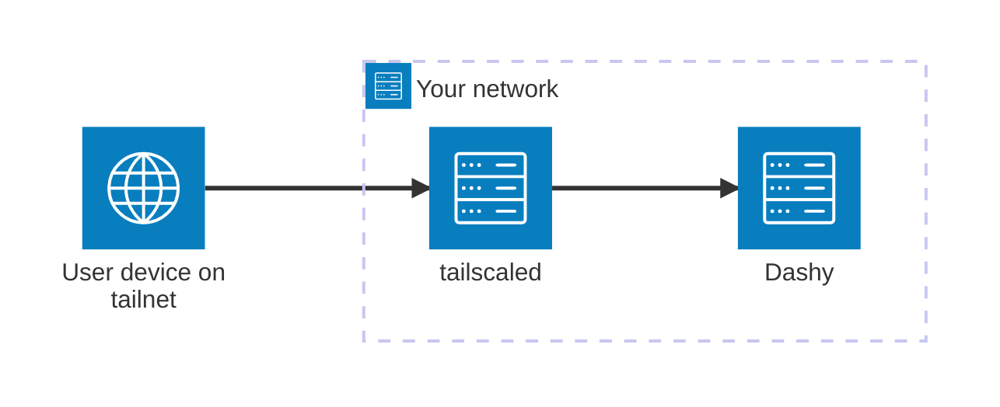
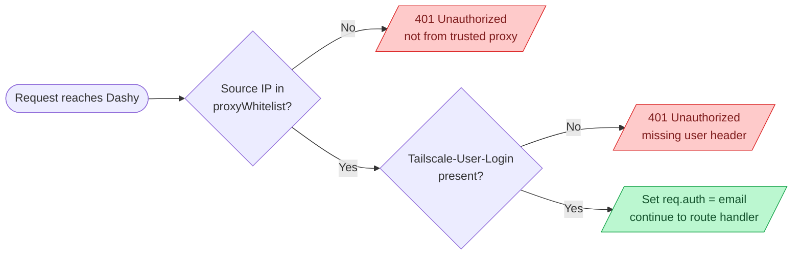
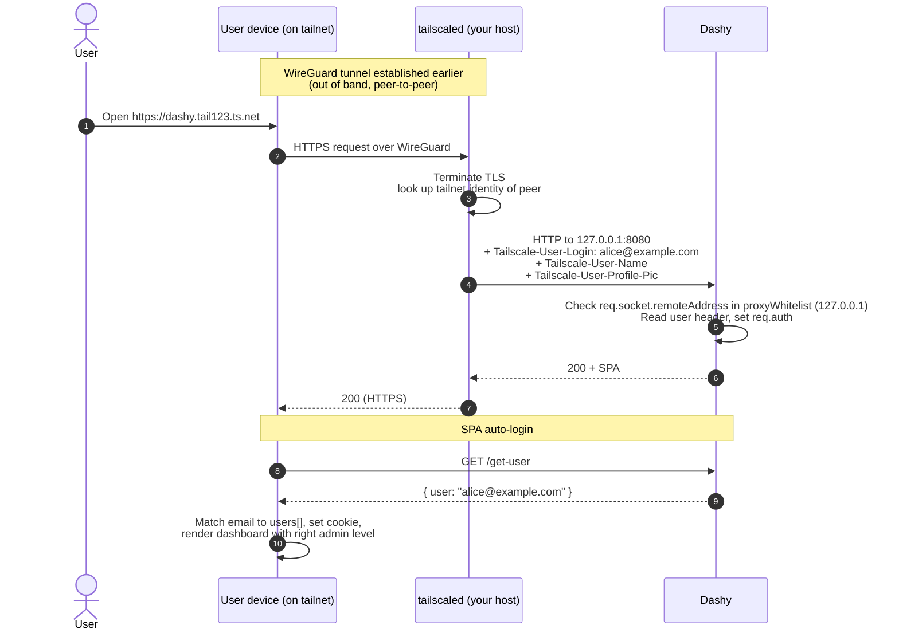

# Tailscale

[Tailscale](https://tailscale.com/) is a popular way to put Dashy on a private network you can reach from your phone, laptop, or any other device you've added to your tailnet, without exposing it to the public internet. With Tailscale Serve in front, requests reaching Dashy already carry the user's identity in HTTP headers, which plugs straight into Dashy's header auth for auto-login.

[Headscale](https://github.com/juanfont/headscale) is a self-hosted control plane that speaks the same protocol. Everything in this guide works with both. There's a short section near the end on what changes when you swap Tailscale's coordination server for your own Headscale instance.

### Contents

- [How it fits together](#how-it-fits-together)
- [Prepare Tailscale](#prepare-tailscale)
- [Run Tailscale + Dashy together](#run-tailscale--dashy-together)
- [Configure Dashy](#configure-dashy)
- [Funnel for public access](#funnel-for-public-access-optional)
- [Using Headscale instead](#using-headscale-instead)
- [Best practices](#best-practices)
- [Troubleshooting](#troubleshooting-common-tailscale-issues)
- [How it Works](#how-it-works)

## How it fits together



The pieces:

- `tailscaled` runs alongside Dashy, joins your tailnet, and obtains a free HTTPS cert for your tailnet hostname
- Tailscale Serve terminates HTTPS and reverse-proxies to Dashy, adding `Tailscale-User-Login`, `Tailscale-User-Name`, and `Tailscale-User-Profile-Pic` headers describing the authenticated tailnet user
- Dashy's header auth reads `Tailscale-User-Login` and matches it to a configured user
- Traffic between user devices and your host runs over WireGuard, peer-to-peer where possible. Tailscale's control plane only mediates key exchange and routing, not the data itself

You need:

- A Tailscale account (free plan covers 100 devices and 3 users)
- An auth key, generated in the admin console
- Docker
- MagicDNS and HTTPS certificates both enabled in your tailnet settings (both on by default)

## Prepare Tailscale

1. Sign in to [the Tailscale admin console](https://login.tailscale.com/admin)
2. Open **DNS** and confirm **MagicDNS** is on, and **HTTPS Certificates** is on. Both are required for Tailscale Serve
3. Open **Settings > Keys > Generate auth key**
4. Pick **Reusable: no**, **Ephemeral: no**, **Pre-approved: yes**, optionally tag with `tag:container`
5. Copy the key (`tskey-auth-...`). You'll paste it into a `.env` next to the compose file

Note your tailnet's domain (something like `tail123abc.ts.net`). Your Dashy host will get a hostname under it once the container starts, e.g. `dashy.tail123abc.ts.net`.

## Run Tailscale + Dashy together

The Tailscale container shares its network namespace with Dashy, so the daemon listens on the tailnet and proxies to `127.0.0.1:8080` (Dashy in the same namespace).

<details>
    <summary>Example <code>docker-compose.yml</code></summary>

```yaml
name: dashy-tailscale

services:
  tailscale:
    image: tailscale/tailscale:latest
    hostname: dashy
    restart: unless-stopped
    environment:
      TS_AUTHKEY: ${TS_AUTHKEY}?ephemeral=false
      TS_STATE_DIR: /var/lib/tailscale
      TS_SERVE_CONFIG: /config/serve.json
      TS_USERSPACE: "false"
      TS_EXTRA_ARGS: --advertise-tags=tag:container
    volumes:
      - ./ts-state:/var/lib/tailscale
      - ./ts-config:/config
      - /dev/net/tun:/dev/net/tun
    cap_add:
      - net_admin
      - sys_module

  dashy:
    image: lissy93/dashy:4.1.5
    restart: unless-stopped
    network_mode: service:tailscale
    environment:
      NODE_ENV: production
      HOST: 0.0.0.0
      PORT: 8080
    volumes:
      - ./user-data:/app/user-data
    depends_on:
      tailscale:
        condition: service_started
    healthcheck:
      test: ["CMD-SHELL", "wget -qO- http://127.0.0.1:8080/healthz >/dev/null 2>&1"]
      interval: 10s
      timeout: 5s
      retries: 10
      start_period: 30s
```

</details>

`.env` next to the compose:

```env
TS_AUTHKEY=tskey-auth-xxx...
```

Then `ts-config/serve.json`:

```json
{
  "TCP": {
    "443": { "HTTPS": true }
  },
  "Web": {
    "${TS_CERT_DOMAIN}:443": {
      "Handlers": {
        "/": { "Proxy": "http://127.0.0.1:8080" }
      }
    }
  }
}
```

`${TS_CERT_DOMAIN}` is substituted by the Tailscale container at runtime with the hostname it gets in your tailnet (e.g. `dashy.tail123abc.ts.net`).

Bring it up:

```bash
docker compose up -d
```

The first run takes ~30 seconds while Tailscale joins the tailnet and provisions an HTTPS cert. After that, your tailnet name shows up in the admin console under **Machines**, and the URL becomes reachable from any device on the tailnet.

Notice what's not in the compose: Dashy has no `ports:` mapping. It's only reachable through Tailscale, never directly.

## Configure Dashy

In `/user-data/conf.yml`:

```yaml
appConfig:
  ...
  disableConfigurationForNonAdmin: true
  auth:
    enableHeaderAuth: true
    users:
      - user: alice@example.com
        hash: "0000000000000000000000000000000000000000000000000000000000000000"
        type: admin
      - user: bob@example.com
        hash: "0000000000000000000000000000000000000000000000000000000000000000"
        type: normal
    headerAuth:
      userHeader: Tailscale-User-Login
      proxyWhitelist:
        - 127.0.0.1
```

Where:
- `enableHeaderAuth` - Turns on header auth mode
- `users` - The email Tailscale sends in `Tailscale-User-Login` must match `user` here. `type` controls admin status in Dashy
- `hash` - Required by Dashy's user schema even though the password is never checked under header auth. Quote it so YAML doesn't parse an all-zero placeholder as the number 0
- `userHeader` - The header `tailscale serve` sets on every proxied request, containing the tailnet user's login (typically email)
- `proxyWhitelist` - Just `127.0.0.1` because `tailscaled` and Dashy share a network namespace, so requests appear to come from localhost

Restart Dashy after editing.

Open `https://dashy.<your-tailnet>.ts.net` from any device on your tailnet. You'll land on the dashboard with the right admin level for your email. No login prompt.

## Funnel for public access (optional)

[Tailscale Funnel](https://tailscale.com/kb/1223/funnel) exposes a tailnet service to the public internet through Tailscale's edge. It uses the same daemon and config, you just flip a switch in `serve.json`:

```json
{
  "TCP": {
    "443": { "HTTPS": true }
  },
  "Web": {
    "${TS_CERT_DOMAIN}:443": {
      "Handlers": {
        "/": { "Proxy": "http://127.0.0.1:8080" }
      }
    }
  },
  "AllowFunnel": {
    "${TS_CERT_DOMAIN}:443": true
  }
}
```

You also need to enable Funnel under **Settings > Funnel** in the admin console and add your node to the allow-list.

**Important caveat on auth:** Funnel requests come from the public internet, where the caller isn't a tailnet member. Tailscale doesn't inject identity headers on Funnel traffic, only on Serve traffic from authenticated tailnet peers. Header auth in Dashy would 401 every public visitor.

For a publicly-exposed Dashy via Funnel, you have two options:

- Use Dashy's [built-in HTTP auth](https://github.com/lissy93/dashy/blob/4.1.5/docs/authentication.md#http-auth) (`ENABLE_HTTP_AUTH=true` with users in `conf.yml`) so the browser prompts for credentials
- Front Funnel with another auth layer, or just don't expose via Funnel and stick to Serve plus the Tailscale apps on the user's devices

For a "Funnel only allows my tailnet users in, but they show up as authenticated" effect, use Serve, not Funnel. Funnel is for "I want anyone on the internet to reach this".

## Using Headscale instead

[Headscale](https://github.com/juanfont/headscale) is a self-hosted reimplementation of Tailscale's coordination server, compatible with the official Tailscale clients. Run your own and you don't depend on Tailscale's cloud for control-plane traffic.

For Dashy, everything in this guide applies unchanged. The only differences are:

- Point the `tailscaled` daemon at your Headscale server via the `TS_EXTRA_ARGS` env var:
  ```yaml
  TS_EXTRA_ARGS: --login-server=https://headscale.example.com --advertise-tags=tag:container
  ```
- Generate auth keys on the Headscale server (`headscale preauthkeys create --user <user>`) instead of the Tailscale admin console
- ACLs are defined in Headscale's policy file rather than the Tailscale admin UI
- MagicDNS HTTPS certificates require Headscale ≥0.23. Older versions don't auto-provision certs, so you'd need to terminate TLS yourself with a reverse proxy. Funnel is also Headscale ≥0.23

The `serve.json` shape, the Dashy header-auth config, and the identity headers (`Tailscale-User-Login` etc.) are identical. Headscale uses the same protocol, so the client behaves the same way.

## Best practices

- Don't bind Dashy's port to the host. Only `tailscaled` should reach it, which is the case if you leave `ports:` off the dashy service and use `network_mode: service:tailscale`
- Treat the auth key as a credential. Tag it (`tag:container`) and rotate it periodically. Prefer non-ephemeral keys for the Dashy node so it survives restarts
- Use Tailscale ACLs to limit who in your tailnet can reach the Dashy node, especially for shared organisations. Configure under **Access controls** in the admin console
- Pin `tailscale/tailscale` to a version tag in production rather than `:latest`. The Docker image follows the daemon's release cadence
- Match Dashy's `users[]` to actual tailnet emails. Every tailnet member who should reach Dashy needs an entry. Promote to admin by setting `type: admin`
- For self-hosting purists, Headscale removes the dependency on Tailscale's coordination server. Otherwise prefer the hosted plan, the free tier is generous and the engineering team owns reliability for you

## Troubleshooting common Tailscale issues

#### Container starts but no machine appears in the Tailscale admin console
Problem: `docker compose logs tailscale` shows the daemon running but it never registers.<br>
Solution: The auth key is wrong, expired, or the wrong type. Generate a fresh **Reusable: No, Ephemeral: No, Pre-approved: Yes** key and update `.env`. Auth keys are single-use unless marked reusable.

#### "no HTTPS server configured for ${TS_CERT_DOMAIN}"
Problem: Serve config references the env-substituted hostname but Tailscale didn't substitute it.<br>
Solution: Older `tailscale/tailscale` images didn't expand `${TS_CERT_DOMAIN}` in `serve.json`. Update to a recent image (`v1.66+` or `latest`), or hardcode your tailnet hostname in `serve.json` (`dashy.tail123abc.ts.net:443`).

#### HTTPS cert never issued
Problem: Browser shows a TLS error visiting the tailnet URL.<br>
Solution: HTTPS certificates aren't enabled for your tailnet. Open **DNS** in the admin console and turn on both **MagicDNS** and **HTTPS Certificates**. Cert issuance takes about a minute after `serve.json` is applied.

#### "401 Unauthorized - not from trusted proxy" from Dashy
Problem: Reaches Dashy but the header auth middleware rejects it.<br>
Solution: `tailscaled` and Dashy must share a network namespace via `network_mode: service:tailscale` for the source IP to be `127.0.0.1`. If they're on different networks, the source IP will be the Tailscale container's IP instead. Update `proxyWhitelist` accordingly, or fix the compose to share the namespace.

#### "401 Unauthorized - missing user header"
Problem: Source IP check passes, but `Tailscale-User-Login` isn't present.<br>
Solution: The request didn't come through `tailscale serve` (maybe Funnel, maybe a direct hit on the tailnet IP without going via Serve). Confirm `serve.json` is loaded by running `docker compose exec tailscale tailscale serve status` and re-issuing the request through the HTTPS URL.

#### Logged in but admin features stay locked
Problem: Authenticates fine, but admin actions return 403.<br>
Solution: The email in `Tailscale-User-Login` doesn't exactly match a `users[].user` with `type: admin`. Run `docker compose exec tailscale tailscale whois <your-tailnet-ip>` to see what login Tailscale will pass through.

#### Funnel users see 401
Problem: You enabled `AllowFunnel`, but visitors from outside the tailnet get 401.<br>
Solution: Expected. Funnel traffic doesn't carry tailnet identity, so header auth has nothing to match. Either drop header auth and use built-in HTTP auth for Funnel-exposed Dashy, or only use Funnel for fully-public read access (no auth, guest mode).

#### Tailscale container exits with "cannot allocate memory" or DEVICE_RESET
Problem: Crash loop on a low-memory host.<br>
Solution: Either bump memory, or set `TS_USERSPACE: "true"` to use the userspace WireGuard implementation (slower but no kernel module dependency). Remove the `/dev/net/tun` volume mount and the `net_admin` and `sys_module` capabilities when in userspace mode.

#### MagicDNS hostname doesn't resolve from the device I'm using
Problem: Other tailnet devices can't reach the Dashy URL even though the machine shows up in the admin console.<br>
Solution: Confirm MagicDNS is on globally (admin console **DNS**) and on the client (`tailscale netcheck` and the Tailscale app's settings). On Linux clients add `--accept-dns=true` to `tailscale up`. Older Linux setups sometimes need `nameserver 100.100.100.100` in `/etc/resolv.conf`.

#### Headscale setup, certs not issued automatically
Problem: Using Headscale, the tailnet hostname works but HTTPS isn't auto-provisioned.<br>
Solution: Headscale's auto-cert support requires version 0.23 or newer. Either upgrade Headscale, or run your own reverse proxy with HTTPS (Caddy, Traefik) in front of the Tailscale daemon and route to it as you would any other internal service.

#### Config change to auth.headerAuth not picked up
Problem: Updated `userHeader`, `proxyWhitelist`, or `users` in `conf.yml`, but Dashy still uses the old values.<br>
Solution: The server reads the auth config only at boot. Restart the Dashy container after any change.

---

## How it Works

### Server side

`tailscaled` runs WireGuard for the data plane and a small HTTPS server in the same container for Tailscale Serve. When a tailnet peer hits `https://dashy.<tailnet>.ts.net`, the request is delivered over WireGuard directly to your host. `tailscaled` terminates TLS using the cert it auto-provisioned, then makes an internal HTTP request to `http://127.0.0.1:8080` (Dashy in the same namespace), adding three headers:

- `Tailscale-User-Login` - the user's tailnet login, typically their email
- `Tailscale-User-Name` - the display name
- `Tailscale-User-Profile-Pic` - a URL to their avatar

Dashy's [header auth middleware](https://github.com/lissy93/dashy/blob/4.1.5/services/app.js) checks `req.socket.remoteAddress` against `proxyWhitelist` (which is `127.0.0.1` because of the shared namespace), reads `Tailscale-User-Login`, and sets `req.auth = { user: <email> }`. The SPA's `HeaderAuth.js` then fetches `/get-user`, matches the email to `users[]`, and sets the session cookie. Same code path as the Cloudflare Tunnel guide, just a different proxy and a different header name.

Identity flows from the user's tailnet membership all the way to Dashy's role-based UI without the user ever entering a password.



<details>

<summary>End-to-end authentication flow</summary>



</details>
