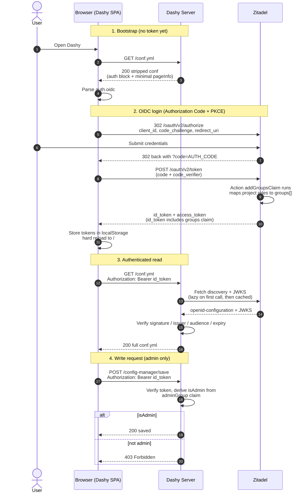
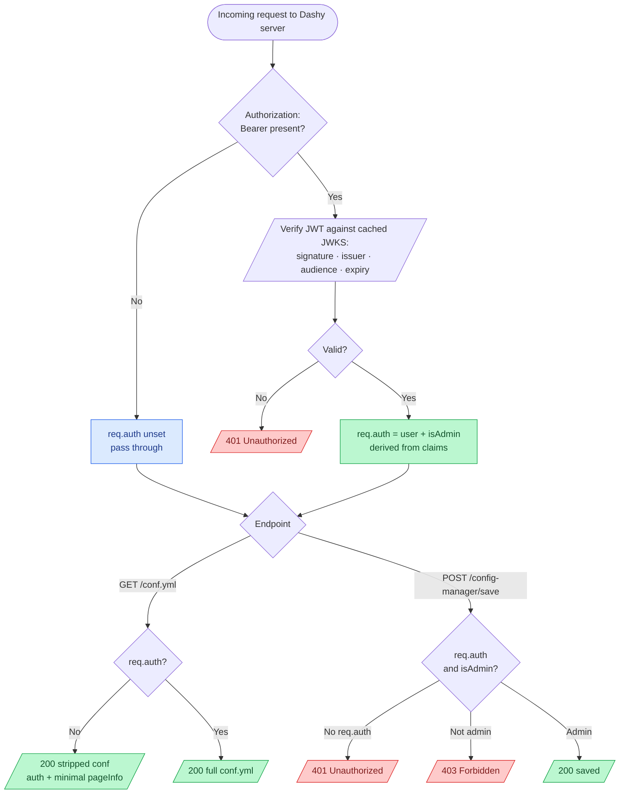

# Zitadel OIDC

Dashy supports using [Zitadel](https://zitadel.com/) as its OIDC provider.

[Zitadel](https://zitadel.com/) is an [open source](https://github.com/zitadel/zitadel) identity and access platform written in Go and backed by Postgres or CockroachDB. It speaks OIDC, OAuth 2.0, and SAML, supports MFA, social login, and per-project role management. The free self-hosted edition is fully featured; there's also a managed cloud option.

> [!IMPORTANT]
> This guide targets Zitadel **v3.4.x**. Zitadel v4 removed the embedded-JS Actions API used to translate Zitadel's role claim format into a `groups` claim Dashy understands. The same flow on v4 needs a sidecar webhook target; see the v4 note in the Action step.

### Contents

- [1. Deploy Zitadel](#1-deploy-zitadel)
- [2. Configure Zitadel](#2-configure-zitadel)
  - [Create the project](#create-the-project)
  - [Create the OIDC application](#create-the-oidc-application)
  - [Create the admin role](#create-the-admin-role)
  - [Grant the role to a user](#grant-the-role-to-a-user)
  - [Map roles to a groups claim](#map-roles-to-a-groups-claim)
  - [Create test users](#create-test-users)
- [3. Enabling Zitadel in Dashy](#3-enabling-zitadel-in-dashy)
- [4. Groups and Visibility](#4-groups-and-visibility)
- [5. Silent token renewal (optional)](#5-silent-token-renewal-optional)
- [Troubleshooting](#troubleshooting-common-zitadel-issues)
- [How it Works](#how-it-works)
  - [Client side](#client-side)
  - [Server side](#server-side)
  - [Visual Overview](#visual-overview)

## 1. Deploy Zitadel

Zitadel needs a Postgres backend. The compose below brings up both, with the admin user pre-created via env, and a machine user PAT written to disk for programmatic setup.

<details>
    <summary>Example <code>docker-compose.yml</code></summary>

```yaml
name: dashy-zitadel

services:
  postgres:
    image: postgres:16-alpine
    restart: unless-stopped
    environment:
      POSTGRES_USER: postgres
      POSTGRES_PASSWORD: postgres
      POSTGRES_DB: zitadel
    healthcheck:
      test: ["CMD-SHELL", "pg_isready -d $${POSTGRES_DB} -U $${POSTGRES_USER}"]
      interval: 5s
      timeout: 5s
      retries: 10
      start_period: 10s
    volumes:
      - ./data/postgres:/var/lib/postgresql/data

  zitadel:
    image: ghcr.io/zitadel/zitadel:v3.4.10
    restart: unless-stopped
    command: 'start-from-init --masterkey "MasterkeyNeedsToHave32Characters" --tlsMode disabled'
    ports:
      - "8080:8080"
    environment:
      ZITADEL_EXTERNALDOMAIN: zitadel.lvh.me
      ZITADEL_EXTERNALPORT: 8080
      ZITADEL_EXTERNALSECURE: "false"
      ZITADEL_PORT: 8080
      ZITADEL_TLS_ENABLED: "false"
      ZITADEL_DATABASE_POSTGRES_HOST: postgres
      ZITADEL_DATABASE_POSTGRES_PORT: 5432
      ZITADEL_DATABASE_POSTGRES_DATABASE: zitadel
      ZITADEL_DATABASE_POSTGRES_USER_USERNAME: postgres
      ZITADEL_DATABASE_POSTGRES_USER_PASSWORD: postgres
      ZITADEL_DATABASE_POSTGRES_USER_SSL_MODE: disable
      ZITADEL_DATABASE_POSTGRES_ADMIN_USERNAME: postgres
      ZITADEL_DATABASE_POSTGRES_ADMIN_PASSWORD: postgres
      ZITADEL_DATABASE_POSTGRES_ADMIN_SSL_MODE: disable
      ZITADEL_FIRSTINSTANCE_ORG_NAME: Dashy
      ZITADEL_FIRSTINSTANCE_ORG_HUMAN_USERNAME: zitadel-admin
      ZITADEL_FIRSTINSTANCE_ORG_HUMAN_PASSWORD: AdminPass2026!
      ZITADEL_FIRSTINSTANCE_ORG_HUMAN_PASSWORDCHANGEREQUIRED: "false"
      ZITADEL_FIRSTINSTANCE_ORG_HUMAN_EMAIL_ADDRESS: admin@example.com
      ZITADEL_FIRSTINSTANCE_ORG_HUMAN_EMAIL_VERIFIED: "true"
      ZITADEL_FIRSTINSTANCE_ORG_HUMAN_FIRSTNAME: Zitadel
      ZITADEL_FIRSTINSTANCE_ORG_HUMAN_LASTNAME: Admin
    depends_on:
      postgres:
        condition: service_healthy
```

</details>

The Zitadel external domain (`zitadel.lvh.me` above) must resolve to the host Zitadel listens on. `lvh.me` and its subdomains resolve to `127.0.0.1` everywhere, so no /etc/hosts edits needed locally.

For production:

- Drop `--tlsMode disabled` and `ZITADEL_EXTERNALSECURE: "false"`
- Put Zitadel behind a reverse proxy on a real domain with HTTPS
- Use a strong masterkey (32 characters, generated fresh: `openssl rand -hex 16`)
- Use a real Postgres password and a dedicated database user, not the `postgres` superuser

Bring it up:

```bash
docker compose up -d
```

First boot runs the database migrations and creates the org, admin user, and a machine user. Once Zitadel is healthy (`curl -sf http://localhost:8080/debug/ready`), open `http://zitadel.lvh.me:8080/ui/console` and sign in as `zitadel-admin` with the bootstrap password.

---

## 2. Configure Zitadel

Steps below are the manual UI walkthrough. Zitadel also has a Management API if you'd rather script the setup.

### Create the project

1. Open the console at `http://zitadel.lvh.me:8080/ui/console`
2. Sign in as `zitadel-admin`
3. Go to **Projects**
4. Click **Create New Project**
5. Set **Name** to `Dashy`, click **Continue**

### Create the OIDC application

1. Open the `Dashy` project
2. Under **Applications**, click **New**
3. Set **Name** to `Dashy`, **Type** to `User Agent`, click **Continue**
4. Set **Authentication Method** to `PKCE`, click **Continue**
5. Set **Redirect URIs** to both:
   - `http://localhost:4000`
   - `http://localhost:4000/`
6. Set **Post Logout URIs** to `http://localhost:4000`, click **Continue**
7. Review and click **Create**

After creation, open the application and:

1. Open **Configuration** (or **Settings**)
2. Turn **Development Mode** on (required for http redirect URIs during local testing; turn it off in production)
3. Turn **ID Token Role Assertion** on so project roles appear in the id_token
4. Turn **ID Token Userinfo Assertion** on (optional but useful for debugging)
5. Click **Save**

Copy the **Client ID** shown on the application page. It's a long numeric string; you'll need it for Dashy's config.

### Create the admin role

1. In the `Dashy` project, open **Roles**
2. Click **New**
3. Set **Key** to `admins`
4. Set **Display Name** to `Dashy admins`
5. Set **Group** to `admins` (this name is also what Dashy's `adminGroup` will match)
6. Click **Save**

### Grant the role to a user

1. Open the `zitadel-admin` user (under **Users**)
2. Open the **Authorizations** tab
3. Click **New**
4. Pick the `Dashy` project
5. Select the `admins` role
6. Click **Save**

### Map roles to a groups claim

By default Zitadel emits roles in a nested `urn:zitadel:iam:org:project:roles` claim. Dashy looks for a flat `groups` array, so an Action is needed to translate.

1. Open your org's settings (top-right menu, **Organisation Settings**), then **Actions**
2. Click **New**
3. Set **Name** to `addGroupsClaim`
4. Paste this script:

```javascript
function addGroupsClaim(ctx, api) {
  if (ctx.v1 && ctx.v1.user && ctx.v1.user.grants && ctx.v1.user.grants.grants) {
    var groups = [];
    for (var i = 0; i < ctx.v1.user.grants.grants.length; i++) {
      var g = ctx.v1.user.grants.grants[i];
      if (g.roles) {
        for (var j = 0; j < g.roles.length; j++) {
          if (groups.indexOf(g.roles[j]) === -1) groups.push(g.roles[j]);
        }
      }
    }
    api.v1.claims.setClaim('groups', groups);
  }
}
```

5. Set **Allowed To Fail** to true (so a bug here doesn't block login entirely)
6. Click **Save**

Now bind it to the token flow:

1. Still in **Actions**, open **Flows**
2. Open **Complement Token**
3. For both **Pre Userinfo Creation** and **Pre Access Token Creation**, click **Add** and select `addGroupsClaim`
4. Click **Save**

> [!NOTE]
> On Zitadel v4 the embedded-JS Actions feature is gone. The same translation needs an Actions v2 target (a small HTTP webhook your Zitadel instance can call). The shape of the script is roughly the same; only the deployment changes. See the [Zitadel v4 Actions docs](https://zitadel.com/docs/concepts/features/actions_v2) for the webhook flow.

### Create test users

If you want users beyond `zitadel-admin`:

1. Go to **Users**, click **New**
2. Fill in **Username** (e.g. `zitadel-user`), **First Name**, **Last Name**, **Email**, click **Continue**
3. Set an initial password and turn off **Password Change Required**
4. Optionally grant the user the `admins` role via **Authorizations** if they should have admin access in Dashy

### Summary

Zitadel should now have a project, an OIDC application, a role, the role granted to your admin user, and an Action that exposes roles as a `groups` claim.

---

## 3. Enabling Zitadel in Dashy

In `/user-data/conf.yml`:

```yaml
appConfig:
  ...
  disableConfigurationForNonAdmin: true
  auth:
    enableOidc: true
    oidc:
      clientId: "1234567890123456789"
      endpoint: http://zitadel.lvh.me:8080
      adminGroup: admins
      scope: openid profile email
```

Where:
- `disableConfigurationForNonAdmin` - Prevent read/write config access to non-admin users
- `auth.enableOidc` - Set the auth mode to OIDC
- `clientId` - The Client ID from Zitadel. **Wrap it in quotes**: Zitadel client IDs are 19-digit numeric strings, which YAML parses as a JS number and loses precision on
- `endpoint` - The Zitadel base URL, which is also its issuer. Dashy appends `/.well-known/openid-configuration` itself
- `adminGroup` - Name of the role that grants admin in Dashy (matches the `admins` role above)
- `scope` - Standard OIDC scopes. Zitadel doesn't need a custom `groups` scope; the Action puts the claim in the token regardless of scope

Restart Dashy for these changes to take effect.

If Zitadel runs on a different host or behind a reverse proxy, make sure `endpoint` is reachable from inside the Dashy container, and that the issuer Zitadel advertises matches `endpoint` exactly.

Everything should now be fully configured and working 🎉
When you load Dashy, you'll be redirected to Zitadel's login page. After signing in, you'll land back on Dashy's homepage with full access, and all of Dashy's client, server and asset endpoints will be locked behind authentication.

---

## 4. Groups and Visibility

Once the Action puts roles in the id_token's `groups` claim, you can use them to hide or show pages, sections and items. The property name is `hideForKeycloakUsers` / `showForKeycloakUsers` (the name is historical; it works for any OIDC provider, including Zitadel).

To make an Admin section visible only to members of `admins`:

```yaml
displayData:
  showForKeycloakUsers:
    groups:
      - admins
```

Both `showForKeycloakUsers` and `hideForKeycloakUsers` accept lists of `groups` and `roles`. If a user matches an entry they're allowed or excluded as defined.

```yaml
sections:
  - name: Internal Tools
    displayData:
      showForKeycloakUsers:
        groups: ['admins']
      hideForKeycloakUsers:
        groups: ['guests']
    items:
      - title: Hidden from interns
        displayData:
          hideForKeycloakUsers:
            groups: ['interns']
```

---

## 5. Silent token renewal (optional)

By default, when your token expires Dashy sends you back through Zitadel's login to get a new one. Set `enableSilentRenew: true` to have Dashy refresh the session quietly in the background instead, using a refresh token:

```yaml
    oidc:
      clientId: "1234567890123456789"
      endpoint: http://zitadel.lvh.me:8080
      adminGroup: admins
      scope: openid profile email
      enableSilentRenew: true
```

Dashy adds the `offline_access` scope to its request automatically. For Zitadel to issue a refresh token, open the application's **Configuration** and make sure the **Refresh Token** grant type is enabled. It's off by default, and if a refresh ever fails Dashy falls back to the normal sign-in. See [silent token renewal](./oidc.md#silent-token-renewal) for the full notes and caveats.

---

## Troubleshooting common Zitadel Issues

#### Numeric Client ID truncated
Problem: Login redirects to Zitadel with the error "client not found" or similar, even though the Client ID looks right.<br>
Solution: Zitadel Client IDs are long numeric strings. Without quotes around the value in `conf.yml`, YAML parses it as a JS number and loses precision past around 15 digits, so the actual value Dashy sends is wrong. Wrap it in quotes: `clientId: "373607668411072515"`.

#### Logged in but config saves return 403
Problem: User authenticates fine, but saving the dashboard returns 403.<br>
Solution: The `groups` claim isn't in the id_token. Paste the token (from localStorage, key `ID_TOKEN`) into [jwt.io](https://jwt.io). If `groups` is missing, the Action either isn't bound to the right triggers, or the user has no project role grants. Check **Actions > Flows > Complement Token** has `addGroupsClaim` on both Pre Userinfo Creation and Pre Access Token Creation, and that the user has been granted the `admins` role under their **Authorizations** tab.

#### Development Mode disabled with http redirect URIs
Problem: Zitadel returns `invalid_redirect_uri` for `http://localhost:4000` on the authorize step.<br>
Solution: Zitadel only accepts http redirect URIs when the OIDC application has **Development Mode** turned on. Open the application's **Configuration** tab and enable it. For production, use HTTPS for both Zitadel and Dashy and leave Development Mode off.

#### "Invalid issuer" on token verification
Problem: Dashy server logs show `unexpected "iss" claim value`. The browser reaches Zitadel at one URL but the issuer in the id_token is different.<br>
Solution: Zitadel's issuer is built from `ZITADEL_EXTERNALDOMAIN`, `ZITADEL_EXTERNALPORT`, and `ZITADEL_EXTERNALSECURE`. Set these to match the public URL exactly. Behind a reverse proxy, make sure the proxy forwards `X-Forwarded-Proto: https` and `X-Forwarded-Host`.

#### Token endpoint CORS blocked
Problem: Browser shows `Cross-Origin Request Blocked` on a POST to `/oauth/v2/token`.<br>
Solution: This usually means **Development Mode** is off on the OIDC application and Zitadel isn't auto-allowing your local origin. Turn it on for local testing. In production, Zitadel allows origins listed in the registered redirect URIs automatically.

#### Action script never fires
Problem: The Action exists but no `groups` claim appears in the token.<br>
Solution: The Action needs to be bound to a flow. Open **Actions > Flows > Complement Token** and confirm `addGroupsClaim` is in both **Pre Userinfo Creation** and **Pre Access Token Creation**. Also check the Action is in **State: Active** (not deactivated).

#### Action exists but tokens have no groups, on Zitadel v4
Problem: v1 Actions were deprecated in Zitadel v4 and no longer fire.<br>
Solution: Either pin to Zitadel v3.4.x (last release line with v1 Actions), or migrate to [Actions v2](https://zitadel.com/docs/concepts/features/actions_v2) which uses HTTP webhook targets. Actions v2 needs an extra service to host the script, so it's a heavier setup.

#### Zitadel UI loads but login fails with "instance not found"
Problem: Visiting Zitadel via an unconfigured hostname returns "Instance not found" or similar.<br>
Solution: Zitadel binds itself to one external domain at first init. Use `http://zitadel.lvh.me:8080` (or whatever `ZITADEL_EXTERNALDOMAIN` is set to), not `http://localhost:8080` or `http://127.0.0.1:8080`.

#### Dashy server can't reach Zitadel
Problem: Auth'd API calls return 401 and Dashy logs show fetch errors for `.well-known/openid-configuration`.<br>
Solution: `endpoint` must be reachable from inside the Dashy container, not just from the browser. If both run in Docker, put them on the same network. Test with `docker exec <dashy-container> wget -qO- "$ENDPOINT/.well-known/openid-configuration"`.

#### Subject claim is a UUID, not a username
Problem: Dashy logs show users with random-looking subject IDs.<br>
Solution: Zitadel's `sub` claim is an opaque per-user ID. Dashy's OIDC client falls through `preferred_username`, `email`, then `sub`, so as long as `profile` and `email` are in the scopes, the username will be human-readable. Make sure both are listed in `scope:` in your Dashy config.

#### Token expired / clock skew
Problem: 401s with `"exp" claim timestamp check failed` or `"iat" claim timestamp check failed`, even just after login.<br>
Solution: Dashy allows 30 seconds of drift. Sync clocks on both hosts with NTP. Container clocks follow their host, so it's almost always the host that's drifted.

#### Config change to auth.oidc not picked up
Problem: Updated `clientId`, `endpoint`, `adminGroup` or `scope` in `conf.yml`, but Dashy still uses the old values.<br>
Solution: The server reads the auth config only at boot. Restart the Dashy container after any change to fields under `auth.oidc`.

#### Postgres fails to start
Problem: Zitadel never reaches ready, Postgres container exits or healthcheck fails.<br>
Solution: Often a stale `data/postgres` directory left over from a previous version. Either run `docker compose down -v` to drop the volume, or `rm -rf data/postgres` and start over. Also confirm the host port 5432 isn't already taken by another Postgres.

---

## How it Works

If you're a developer or contributor looking to understand or make changes to Dashy's OIDC implementation, the following outlines how it's wired together.

The same OIDC pipeline backs Zitadel, Authelia, Authentik, Keycloak, and any other generic OIDC provider. The only Zitadel-specific piece is the Action that maps project roles to the `groups` claim; everything on the Dashy side is shared.

### Client side

Boot starts in [`src/main.js`](https://github.com/lissy93/dashy/blob/4.1.5/src/main.js). After the initial `/conf.yml` fetch parses the auth block, `isOidcEnabled()` decides whether to lazily import [`oidc-client-ts`](https://github.com/authts/oidc-client-ts) and call `initOidcAuth()`.

[`src/utils/auth/OidcAuth.js`](https://github.com/lissy93/dashy/blob/4.1.5/src/utils/auth/OidcAuth.js) wraps `oidc-client-ts`. On load it inspects the URL: if it sees a `?code=` callback it runs `userManager.signinCallback()` to exchange the code (and PKCE verifier) for tokens, persists the user info, and hard-redirects to `/`. Otherwise it calls `userManager.getUser()`; if there's no usable session it falls through to `userManager.signinRedirect()` to send the browser to Zitadel. A short-lived `sessionStorage` guard prevents the redirect loop that would otherwise occur if the IdP returns without a usable user.

`persistUserInfo()` writes the raw `id_token`, the user's `groups` and `roles`, a derived `isAdmin` flag, and a username (falling back through `preferred_username`, `email`, and `sub`) to localStorage. The keys (`ID_TOKEN`, `KEYCLOAK_INFO`, `USERNAME`, `ISADMIN`) live in [`src/utils/config/defaults.js`](https://github.com/lissy93/dashy/blob/4.1.5/src/utils/config/defaults.js); the `KEYCLOAK_INFO` name is historical and reused for all OIDC providers, including Zitadel.

[`src/utils/auth/getApiAuthHeader.js`](https://github.com/lissy93/dashy/blob/4.1.5/src/utils/auth/getApiAuthHeader.js) builds the Authorization header for every internal API call. It does a client-side `exp` check and returns `null` for missing or expired tokens, so the next request triggers a fresh login rather than a 401.

[`src/utils/IsVisibleToUser.js`](https://github.com/lissy93/dashy/blob/4.1.5/src/utils/IsVisibleToUser.js) reads `KEYCLOAK_INFO` when evaluating `showForKeycloakUsers` and `hideForKeycloakUsers` rules.

### Server side

[`services/auth-oidc.js`](https://github.com/lissy93/dashy/blob/4.1.5/services/auth-oidc.js) contains the entire server-side auth surface, in five small pieces:

- `loadOidcSettings()` reads `auth.oidc` (or `auth.keycloak`) at boot and returns a normalised `{ issuer, clientId, adminGroup, adminRole }`. For generic OIDC providers the `issuer` is whatever you set as `endpoint` in `conf.yml`, verbatim
- `createOidcMiddleware()` returns a Connect middleware. Permissive on no-token requests so the SPA can bootstrap; otherwise it verifies the Bearer token against the issuer's JWKS using [`jose`](https://github.com/panva/jose). Checks cover signature, issuer (against the canonical value from the discovery doc), audience (must equal `clientId`), and expiry, with a 30-second clock-skew tolerance. Sets `req.auth = { user, isAdmin, claims }` on success, `401` on failure
- `getIssuerContext()` lazily fetches `.well-known/openid-configuration` on first use and wraps `jwks_uri` in `createRemoteJWKSet`, which handles JWKS caching and on-demand key rotation. The result is memoised per-issuer for the life of the process
- `deriveIsAdmin()` checks the token's `groups` claim against `adminGroup`, and the top-level `roles` claim against `adminRole` (for Keycloak it also folds in the nested `realm_access.roles` / `resource_access.<clientId>.roles` arrays). Zitadel emits roles in a different format, which is why the Action maps them into a flat `groups` array for Dashy
- `maybeBootstrapConfig()` is the stripped-response helper. When auth is configured, guest access is off, and an unauthenticated request hits the root `/conf.yml`, it returns a minimal copy with only `appConfig.auth`, `appConfig.enableServiceWorker`, and a `pageInfo.title` of `Login | <your title>`. Sections, items, hostnames and any other secrets never leave the server

[`services/app.js`](https://github.com/lissy93/dashy/blob/4.1.5/services/app.js) wires it all together. The middleware mounts as `protectConfig` in front of every YAML route and config-mutating route. The `/*.yml` handler sets `Cache-Control: private, no-store` and `Vary: Authorization` whenever auth is configured (so intermediate caches can never mix auth states), then calls `maybeBootstrapConfig`; a stripped result is sent as-is, otherwise `res.sendFile` serves the full file. `POST /config-manager/save` is additionally guarded by `requireAdmin`, which returns `401` if `req.auth` is unset and `403` if `req.auth.isAdmin` is false.

### Visual Overview

<details>

<summary>End-to-end authentication flow</summary>



</details>


<details>

<summary>Server-side request handling</summary>



</details>
